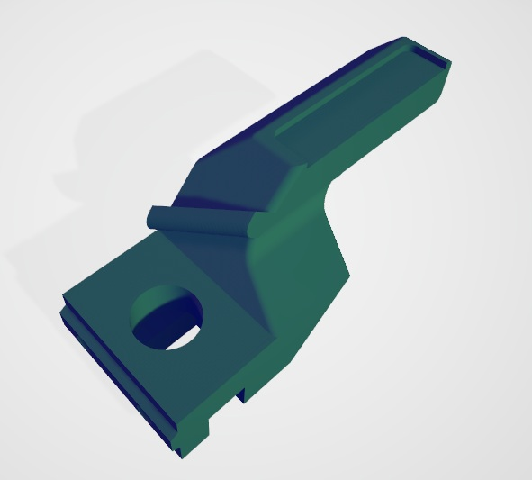
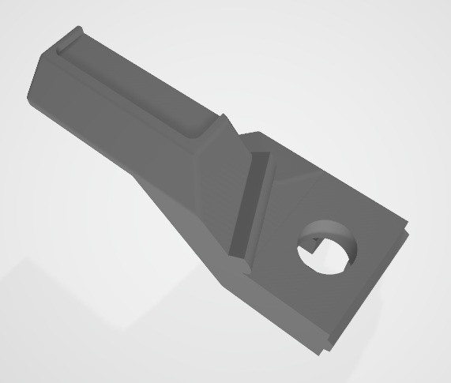
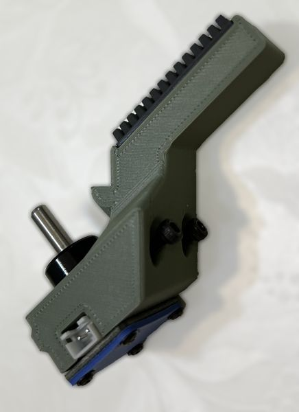
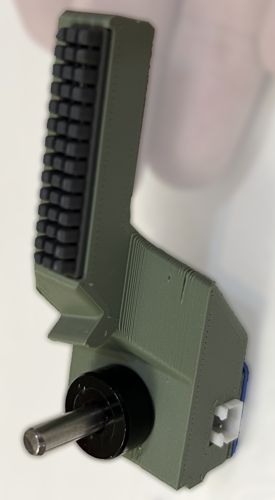
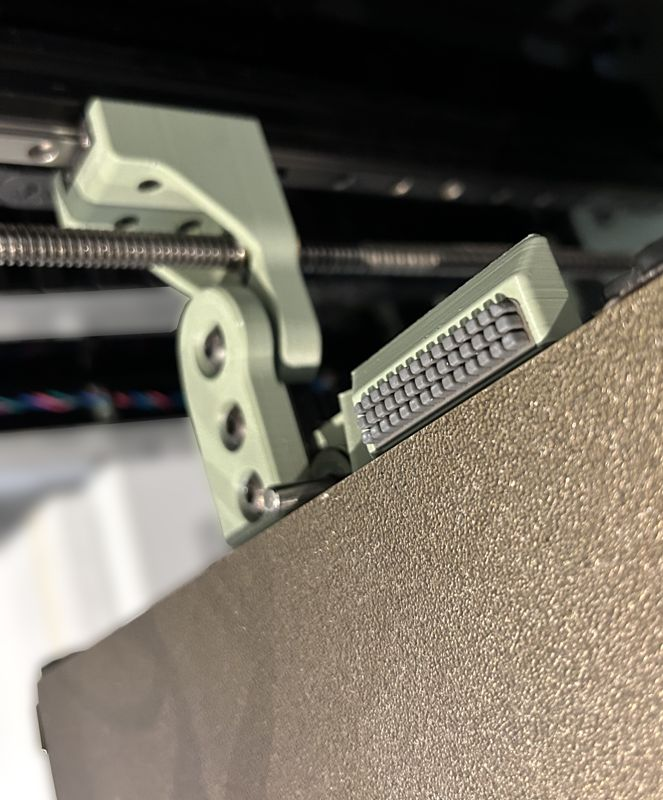
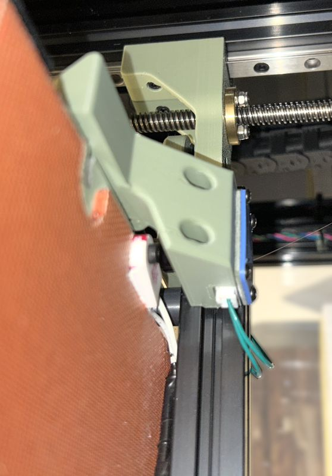

# Voron Trident Z-Endstop With Nozzle Wisher

This design was developed to replace the Z-Endstop of the Voron Trident design by an improved version, that also features a support for a silicone nozzle wisher.

I chose the Nozzle Silicone Brush for the Creality K1, K1C, since it is easily available. In my case bought it here: [AliExpress FYSETC Official Store](https://de.aliexpress.com/item/1005008164354026.html).

This is the body of this part:



and from the other side:




## Features

- Compatible with easy to find self adhesive K1 silicone replacements
- Compact, because it reuses the existing endstop space
- Incorporates a dirt blocker, to avoid interference with the mechanical endstop
- Uses the back location, where the printer still has space


## Print Procedure

Use usual Voron profile to print the part. The part was designed to be printed without the need of supports. You have to orient it correctly, keeping the flat side facing down at your print bed.


## Install Procedure

### Assembly of the Part

These are the steps:
- Remove the old Z-Endstop, disconnecting cables and removing screws
- Move the pole system from the old to this part. It is recommend to use some soft glue to ensure stability.
- Move the PCB to the new body
- Reuse the PCB cover, since it is compatible
- Release the screws of your print bed and force it to the front as much as possible, then re-tight the screws at that position.  
Usable space is very constrained on the Voron Trident, forcing you to use the extremes of your Y axis.
- Attach a silicone wisher on the pocket






### Installing on the Printer

- Now place the body, reusing the T-Nuts of the old part. Don't tighten it completely. The required screws are now longer: M3x20mm.
- Before tightening the new body, use a putty knife between the print bed and the part, to make sure it does not contact it directly. then tighten the screws.  
A thin air gap helps thermal isolation.
- Reconnect the endstop cable.






## Calibration Tips

### Y-Axis

After this you have to recalibrate your Y axis, according to the Voron setup guides. 

```gcode
[stepper_y]
...
position_min = -1
position_endstop = 258
position_max = 258
...
```

Please test your setup with care. When moving to the extreme, you should not hear the sound of your print head hitting the limit.

### Z-Axis

Please test your Z-endstop for functionality before homing your printer. You have to follow Voron guides on how to fine tune the Z-endstop and finally recalibrate your Z-offset.

I have a Voron Trident 250 and my endstop configuration is this:

```gcode
[safe_z_home]
home_xy_position = 147,257
speed = 100
z_hop = 10
```

Or for sensorless homing:

```gcode
[homing_override]
	...
	G1 X147 Y257 F15000
	...
```


## Nozzle Wipe Macro

```gcode
[gcode_macro NOZZLE_WIPE]
description: Cleans the nozzle on the rear silicone wiper pad.
gcode:
	# --- Check for homing and ensure safe Z height ---
	
		G28 Z  ; Ensure Z is homed if not already done
	

	
	

	# Ensure Z is at least at SAFE_Z_HEIGHT (5mm).
	
		G0 Z{SAFE_Z_HEIGHT} F600  ; Move Z up to 5mm
	

	# --- Setup and Initial Move ---
	G90                   ; Use Absolute Positioning
	M400                  ; Wait for current moves to finish
	
	
	
	
	
	
	
	
	
	
	

	# First we travel to a edge, because a long filament tail forms after long pause in a hot state.
	# This makes sure that this tail is behing the nozzle on an area where no build plate can sustain 
	# this excess. (X250, Y257)
	# The next move ensures this...
	G0 X250 Y257 F6000
	G0 Z{SAFE_Z_HEIGHT} F600
	
	# Fast travel to the start position (X165, Y257)
	G1 X{X0} Y{Y0} Z0.5 F4800

	# --- WIPE PASS 1 (Z=0.3mm) ---
	G0 Z{Z0} F600		; Move Z down to 1.2mm

	 ; 120 mm/s = 7200 mm/min

	# Sequence 1: 165,256 -> 215,255 (50mm X wipe)
	G1 X{X1} Y{Y1} F{WIPE_SPEED} 
	# Sequence 2: 215,255 -> 165,254 (50mm X wipe back)
	G1 X{X0} Y{Y2} Z{Z1} F{WIPE_SPEED}

	# --- WIPE PASS 2 (Z=0.1mm) ---
	M400				; Wait for Z move

	# Repeat the same sequence for the second pass

	# Sequence 1: 165,254 -> 215,255 
	G1 X{X1} Y{Y1} F{WIPE_SPEED} 
	# Sequence 2: 215,255 -> 165,256 
	G1 X{X0} Y{Y0} Z{Z2} F{WIPE_SPEED}

	# --- WIPE PASS 3 (Z=-0.2mm) ---
	M400				; Wait for Z move

	# Sequence 1: 165,256 -> 215,256 (50mm X wipe)
	G1 X{X1} F{WIPE_SPEED} 
	# Sequence 2: 215,256 -> 215,254 (3mm Y move)
	G1 Y{Y2} F{WIPE_SPEED}
	# Sequence 3: 215,254 -> 165,254 (50mm X wipe back)
	G1 X{X0} F{WIPE_SPEED}

	# --- Final Retraction ---
	G0 Z{Z_END} F600	; Move Z up to 10mm
	M400				; Wait for final Z move
```
