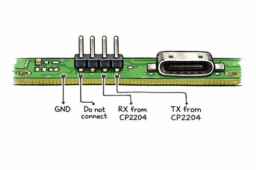

# General Install Instructions (Armbian Minimal)

> This is an alternative installation for the NanoPC-T4 using community maintained Armbian distro. Armbian uses less disk space and a brand new Linux kernel when compared to the official distribution. Please follow the [02-install-OS.md](02-install-OS.md) guide to install official image for the *stable path option*.

Latest Armbian is surprisingly working with the new Linux kernel.

Download in: https://github.com/armbian/community/releases/tag/26.2.0-trunk.493

File is `Armbian_community_26.2.0-trunk.493_Nanopct4_trixie_current_6.18.13_minimal.img.xz`.

You will need a Linux installation to install this image.


## Connecting PC

Use an USB-C cable and connect to your Windows PC.


### Optional COM port (Highly Recommended)

I also installed a USB/Serial TTL converter like the **CP2204** running on my Windows machine to monitor the SBC.  
The connection is at the side of the USB-C connector. Pin 1 begins at the side of the flat cable connector.
- **Pin 1:** GND
- **Pin 2:** Do not connect
- **Pin 3:** RX from the **CP2204**
- **Pin 4:** TX from the **CP2204**



Configure **Putty** or similar for the detected COM port using **1500000** as BAUD rate.  
This way you won't need a keyboard+monitor to run the initial configuration steps.


# Install Image

The easiest for is to have a Linux machine. I have Ubuntu, so my examples are taken from there.

## Prepare Ubuntu Linux machine

Apply updates:

```sh
sudo -i
apt update
apt upgrade
apt install -y rkdeveloptool usbutils
```

## Obtain the `MiniLoaderAll.bin` from Official FriendlyElec Site

A loader is required to work with low level tools. This file is called `MiniLoaderAll.bin` and is distributed with the RkDevTool (mine is v3.37) found on FriendlyElec site.

Copy the `MiniLoaderAll.bin` boot loader to Ubuntu home directory (`root` user plz). I use WinSCP for this.

## Copy the Image File

Extract and copy the `Armbian_community_26.2.0-trunk.493_Nanopct4_trixie_current_6.18.13_minimal.img` file into the root home directory, using WinSCP.

## Connecting PC

Use an USB-C cable and connect to your Linux PC.


## Booting SBC in MaskRom Mode

Use these buttons:
- **`RESET` button:** Near the USB-C connector
- **`BOOT` button:** Between the `RECOVER` button and the 12V Fan connector

Procedure:
- Power SBC on
- Hold the `RESET` and the `BOOT` button at the same time. 
- Release `RESET` while holding `BOOT`
- Keep `BOOT` pressed for **5 seconds**, then release it.


## Check Connection

Type on Linux:

```sh
lsusb
```

Which approximately results:

```raw
Bus 001 Device 001: ID 1d6b:0002 Linux Foundation 2.0 root hub
Bus 001 Device 002: ID 26ce:01a2 ASRock LED Controller
Bus 002 Device 001: ID 1d6b:0003 Linux Foundation 3.0 root hub
Bus 003 Device 001: ID 1d6b:0002 Linux Foundation 2.0 root hub
Bus 003 Device 002: ID 0bda:5411 Realtek Semiconductor Corp. RTS5411 Hub
Bus 003 Device 003: ID 4348:7048 WinChipHead CH545
Bus 003 Device 004: ID 001f:0b21 Generic USB Audio
Bus 003 Device 005: ID 046a:0113 CHERRY KC 6000 Slim Keyboard
Bus 003 Device 006: ID 09da:3be3 A4Tech Co., Ltd. USB Device
Bus 003 Device 007: ID 1a86:e010 QinHeng Electronics HKS0401A3U
Bus 004 Device 001: ID 1d6b:0003 Linux Foundation 3.0 root hub
Bus 004 Device 002: ID 0bda:0411 Realtek Semiconductor Corp. Hub
Bus 005 Device 001: ID 1d6b:0002 Linux Foundation 2.0 root hub
Bus 005 Device 003: ID 2207:330c Fuzhou Rockchip Electronics Company RK3399 in Mask ROM mode
Bus 006 Device 001: ID 1d6b:0003 Linux Foundation 3.0 root hub
```

> Note that the SBC USB device (`ID 2207:330c`) is attached to the virtual machine.


## Check RK3399 Connection

Lets make sure you are using root account. Type 'sudo -i` if needed.

Check with:
```sh
$ rkdeveloptool ld
DevNo=1 Vid=0x2207,Pid=0x330c,LocationID=101    Maskrom
```

## Load Boot Loader


```sh
rkdeveloptool db MiniLoaderAll.bin
```

## Erase eMMC

```sh
rkdeveloptool ef
```

> This command is very fast and needs less than 10s to clear eMMC completely.

## Write Image

```sh
rkdeveloptool wl 0 Armbian_community_26.2.0-trunk.493_Nanopct4_trixie_current_6.18.13_minimal.img
```

> This command needs a couple of minutes, but it is considerably faster than the SD Card method.

## Reset the device

```sh
rkdeveloptool ef
```

If you are using the serial port, you can notice a classic Linux boot happening, which is done in more than one iteration.

Wait until you receive the login prompt.

If you are not using the serial port, you have to attach a keyboard/screen to your SBC to continue.


## Initial Configuration

Keep a LAN cable connected to help initial setup without the need of WiFi.

Follow the onscreen instruction:
- Initial Armbian login: `root` / `1234`
- Define a `root` password
- Create a `klipper` user

> **Follow all steps on this article using the root account.**

### Check for network connection

To check IP address:

```sh
ip a
```


## Install SSH Keys (Optional)

Install SSH Keys for better Putty WinSCP integration:

```sh
sudo -i
cd ~
mkdir .ssh			# only if not exists
chmod 0700 .ssh
cd .ssh
# Note replace by real valid keys
echo ssh-rsa AAAA...g4GwqAvMD6PRygl grumat-20220428 >> authorized_keys
echo ssh-rsa AAAA...PoT9AB9Lj/w== rsa-key-bjmm-20181215 >> authorized_keys
echo ssh-rsa AAAAAAABAAABA...5Pti1IMzSwh3Qt+c6JoR SW-X4 >> authorized_keys
chmod 0600 authorized_keys
```

## Configuring Network

Set the hostname:
```sh
$ nano /etc/hostname
$ nano /etc/hosts
```

Default is `nanopc-t4`, but probably you will want to rename to `trident` or `voron`.

Now lets set fixed IP addresses and an interface bond to join `eth0` and `wlan0` in the same IP address:

```sh
# Make sure this service does not run (may cause a two minutes pause on startup)
$ systemctl disable systemd-networkd-wait-online.service
# Remove DHCP rules
$ cd /etc/netplan
$ mv 10-dhcp-all-interfaces.yaml 10-dhcp-all-interfaces.yaml.bak
# Add a new profile with static interfaces
$ nano /etc/netplan/01-armbian.yaml
```

Use this template to edit your network:

```ini
network:
  version: 2
  renderer: networkd  # or 'NetworkManager' if you prefer

  ethernets:
    eth0:
      dhcp4: yes

  wifis:
    wlan0:
      dhcp4: yes
      access-points:
        "BJMM":
          password: "b1882e5e0125bdf53896a0d6e205e61fc77e94cc9d048a91e8ee7afcbc84ab4e"

  bonds:
    bond0:
      interfaces: [eth0, wlan0]
      parameters:
        mode: active-backup
        primary: eth0
        mii-monitor-interval: 100
      addresses: [192.168.0.30/24]
      routes:
        - to: default
          via: 192.168.0.138
      nameservers:
        addresses: [192.168.0.138, 8.8.8.8, 8.8.4.4]
```

> Values to be replaced:
> - `YourSSID`: The SSID of your home network
> - `YourPassword`: The password for your WiFi network (make sure that only `root` have r/w access to this file; see the next section on how to obfuscate this password)
> - `192.168.0.30` The static IP address of your 3D printer
> - `192.168.0.138` Gateway and DNS IP address (default is for A1 router)

To apply the configuration:

```sh
$ chmod 0600 /etc/netplan/01-armbian.yaml
$ netplan apply
```


### Obfuscating WiFi Password

Use `wpa_supplicant` to generate an obfuscated password:

```sh
$ wpa_passphrase "YourSSID" "YourPassword"
network={
        ssid="YourSSID"
        #psk="YourPassword"
        psk=825002b2191a09e2238bb750d5c09b143bfac69a473d0c485f9d4347835b9aa6
}
```

Copy and paste this password into the `password:` field of your `/etc/netplan/01-armbian.yaml` file.


## Support for CAN (optional)

```sh
# Install required tools
$ apt install can-utils
# Now add the can interface
$ echo -e 'SUBSYSTEM=="net", ACTION=="change|add", KERNEL=="can*"  ATTR{tx_queue_len}="128"' | sudo tee /etc/udev/rules.d/10-can.rules > /dev/null
$ echo -e "[Match]\nName=can*\n\n[CAN]\nBitRate=1M\n\n[Link]\nRequiredForOnline=no" | sudo tee /etc/systemd/network/25-can.network > /dev/null
```

Reboot to apply:

```sh
$ reboot now
```


## General Network Interfaces Checkup

```sh
$ ip a
1: lo: <LOOPBACK,UP,LOWER_UP> mtu 65536 qdisc noqueue state UNKNOWN group default qlen 1000
    link/loopback 00:00:00:00:00:00 brd 00:00:00:00:00:00
    inet 127.0.0.1/8 scope host lo
       valid_lft forever preferred_lft forever
    inet6 ::1/128 scope host noprefixroute
       valid_lft forever preferred_lft forever
2: eth0: <BROADCAST,MULTICAST,SLAVE,UP,LOWER_UP> mtu 1500 qdisc mq master bond0 state UP group default qlen 1000
    link/ether 72:6d:44:aa:11:22 brd ff:ff:ff:ff:ff:ff permaddr 4a:11:0e:0c:5a:9d
    altname end0
    altname enx4a110e0c5a9d
3: bond0: <BROADCAST,MULTICAST,MASTER,UP,LOWER_UP> mtu 1500 qdisc noqueue state UP group default qlen 1000
    link/ether 72:6d:44:aa:11:33 brd ff:ff:ff:ff:ff:ff
    inet 192.168.0.30/24 brd 192.168.0.255 scope global bond0
       valid_lft forever preferred_lft forever
    inet6 fe80::7c8d:47ff:fe8a:4bb1/64 scope link proto kernel_ll
       valid_lft forever preferred_lft forever
4: can0: <NOARP,UP,LOWER_UP,ECHO> mtu 16 qdisc pfifo_fast state UP group default qlen 128
    link/can
5: wlan0: <BROADCAST,MULTICAST,SLAVE,UP,LOWER_UP> mtu 1500 qdisc pfifo_fast master bond0 state UP group default qlen 1000
    link/ether 7e:8d:47:8a:4b:b1 brd ff:ff:ff:ff:ff:ff permaddr 72:6d:44:aa:11:44
    altname wlxd41243e2f256
```

## Install Other Packages

Always using `root`, install:

```sh
apt install -y git
apt install -y build-essential
apt install -y python3 python3-pip
apt install -y python3-numpy python3-matplotlib libatlas3-base libopenblas-dev
apt install python3-serial
```


## Locale Fine Tuning (Optional)

I personally like English messages, but metrics system. So do the following:

- Edit `/etc/locale.gen` and uncomment the `de_AT.UTF-8 UTF-8` line.
- Edit `/etc/locale.conf` and ensure this looks like:

```ini
#  File generated by update-locale
LANG=C.UTF-8
LC_CTYPE=de_AT.UTF-8
LC_TIME=de_AT.UTF-8
LC_COLLATE=de_AT.UTF-8
LC_MONETARY=de_AT.UTF-8
LC_PAPER=de_AT.UTF-8
```

- Finally command:

```sh
$ locale-gen
$ update-locale
```


## System Fine Tuning

```sh
$ nano /etc/systemd/system/set-cpu-governor.service
```

Store the following contents on `/etc/systemd/system/set-cpu-governor.service` file:

```ini
[Unit]
Description=Set CPU governor for cores 4 and 5 to performance

[Service]
Type=oneshot
ExecStart=/bin/sh -c 'echo performance > /sys/devices/system/cpu/cpu0/cpufreq/scaling_governor'
ExecStart=/bin/sh -c 'echo schedutil > /sys/devices/system/cpu/cpu4/cpufreq/scaling_governor'

[Install]
WantedBy=multi-user.target
```

Start the service

```sh
$ systemctl start set-cpu-governor.service
$ systemctl enable set-cpu-governor.service
```

Check with:

```sh
$ cat /sys/devices/system/cpu/cpu*/cpufreq/scaling_governor
performance
performance
performance
performance
schedutil
schedutil
```


### SSH Keys for `klipper` User (Optional)

In the case you want to use the same SSH keys with the `klipper` user:

```sh
$ mkdir /home/klipper/.ssh
$ cp ~/.ssh/authorized_keys /home/klipper/.ssh/
$ chown -R klipper:klipper /home/klipper/.ssh
```


### (Optional but recommended) Allow passwordless sudo for Klipper

Klipper scripts often assume non-interactive sudo.

Create a dedicated sudoers drop-in:

```sh
$ nano /etc/sudoers.d/klipper
$ chmod 0600 /etc/sudoers.d/klipper
```

Add **exactly** this line:

```ini
klipper ALL=(ALL) NOPASSWD:ALL
```

### Extra: serial/USB access (you’ll likely need this)

Klipper usually needs access to USB serial devices.

Add the user to required groups:

```sh
$ usermod -aG dialout,tty,video,input klipper
$ newgrp dialout
```

