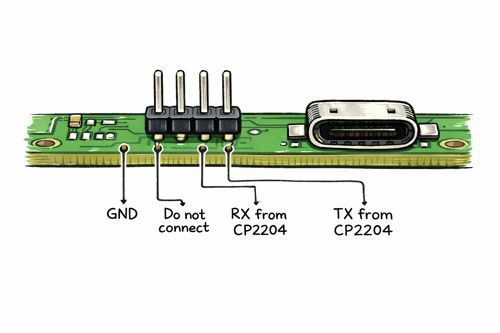
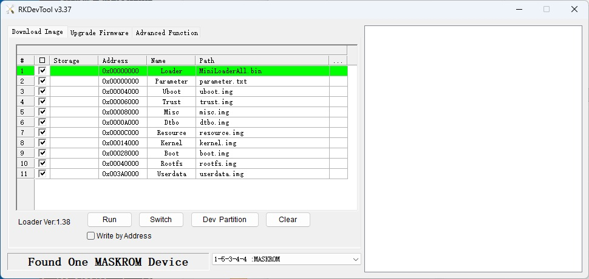

# OS Download

# General Install Instructions (Debian Minimal)

The official Debian Minimal installation is very straightforward in Windows. Download and unzip package ( in my case `rk3399-usb-debian-trixie-core-4.19-arm64-20260112.zip`).

[One Drive &rarr; 01_Official images &rarr; 02_SD-t-eMMC Images &rarr; rk3399-eflasher-debian-trixie-core-4.19-arm64-20260112.img.gz](http://download.friendlyelec.com/NanoPC-T4)

Extract it on a known location.

> The application that install is `.\rk3399-usb-debian-trixie-core-4.19-arm64-20260112\RKDevTool.exe`.  
**Do not run it** until drivers and everything is working OK.


## Download Device Driver (Single TIme Only)

Download it from the official site:

[One Drive &rarr; 05_Tools &rarr; DriverAssistant_v5.12.zip](http://download.friendlyelec.com/NanoPC-T4)

Extract it on a known location.


## Connecting PC

Use an USB-C cable and connect to your Windows PC.


### Optional COM port (Highly Recommended)

I also installed a USB/Serial TTL converter like the **CP2204** running on my Windows machine to monitor the SBC.  
The connection is at the side of the USB-C connector. Pin 1 begins at the side of the flat cable connector.
- **Pin 1:** GND
- **Pin 2:** Do not connect
- **Pin 3:** RX from the **CP2204**
- **Pin 4:** TX from the **CP2204**



Configure **Putty** or similar for the detected COM port using **1500000** as BAUD rate.  
This way you won't need a keyboard+monitor to run the initial configuration steps.


## Booting SBC in MaskRom Mode

Use these buttons:
- **`RESET` button:** Near the USB-C connector
- **`BOOT` button:** Between the `RECOVER` button and the 12V Fan connector

Procedure:
- Power SBC on
- Hold the `RESET` and the `BOOT` button at the same time. 
- Release `RESET` while holding `BOOT`
- Keep `BOOT` pressed for **5 seconds**, then release it.


## Install Device Drivers (once)

Locate the DriverAssistant you've downloaded and install device drivers running `DriverInstall.exe`.


# Flashing Linux

## Open `RKDevTool.exe`

On the Debian package you've downloaded open the `RKDevTool.exe`




## Check Connection

You must see the `Found One MASKROM device` message. If not repeat the SBC boot.


## Flash Linux

Just click `[Run]` button.

A couple of minutes and device is automatically restarted:
- Disconnect the USB-C cable
- You can close the Windows flashing tool.
- Hopefully you are using the Serial Console, which is a way to proceed without an additional keyboard/Monitor.


# Configuration

## Login

- login: **pi**
- password: **pi**


## Initial Configuration

Keep a LAN cable connected to help initial setup without the need of WiFi.

To check IP address:

```sh
ip a
```


## Install SSH Keys (Optional)

Install SSH Keys for better Putty WinSCP integration:

```sh
sudo -i
cd ~
mkdir .ssh			# only if not exists
chmod 0700 .ssh
cd .ssh
# Note replace by real valid keys
echo ssh-rsa AAAA...g4GwqAvMD6PRygl grumat-20220428 >> authorized_keys
echo ssh-rsa AAAA...PoT9AB9Lj/w== rsa-key-bjmm-20181215 >> authorized_keys
echo ssh-rsa AAAAAAABAAABA...5Pti1IMzSwh3Qt+c6JoR SW-X4 >> authorized_keys
chmod 0600 authorized_keys
```


## Editing WLAN password

```sh
nmtui
```

- Activate a connection
    - Select your WiFI network
	- Type in your password
- Set System Hostname
	- Hostname: **Trident**


## Preparing the `bond0` connection

We make sure to disable `networking.service`, since recent **Debian** uses **Network Manager**, which supersedes the older one. Mixing configuration among them may cause conflicts.

```sh
systemctl stop networking.service
systemctl disable networking.service
apt install -y ifenslave
echo "bonding" >> /etc/modules-load.d/bonding.conf
echo "options bonding mode=active-backup miimon=100 max_bonds=1" >> /etc/modprobe.d/bonding.conf
modprobe bonding
```

## Creating the `bond0` connection

Check if you have `eth0` and `wlan0` up and running:

```sh
nmcli device status
```

Lets start adding the bond network

```sh
# Specify how bond0 will be
$ nmcli con add type bond con-name bond0 ifname bond0 bond.options "mode=active-backup,fail_over_mac=active,miimon=100,primary=eth0"
$ nmcli con modify bond0 ipv4.addresses 192.168.0.30/24 ipv4.gateway 192.168.0.138 ipv4.dns "8.8.8.8,1.1.1.1" ipv4.method manual

# Regular LAN cable connection
$ nmcli con add type ethernet slave-type bond con-name bond-eth0 ifname eth0 master bond0

# Please enter the real SSID
$ nmcli con add type wifi slave-type bond con-name bond-wlan0 ifname wlan0 master bond0 ssid MyHome
# Please enter the real password
$ nmcli con modify bond-wlan0 wifi-sec.key-mgmt wpa-psk wifi-sec.psk 123456

$ nmcli con up bond0
```

Reboot and check your network connection.

```sh
root@TridentNew:~# nmcli device status
DEVICE         TYPE      STATE                   CONNECTION
bond0          bond      connected               bond0
eth0           ethernet  connected               bond-eth0
wlan0          wifi      connected               bond-wlan0
lo             loopback  connected (externally)  lo
p2p-dev-wlan0  wifi-p2p  disconnected            --
```


## Install Other Packages

Always using `root`, install:

```sh
sudo -i	    # use this to enter root

apt update
apt upgrade
apt install -y git
apt install -y build-essential
apt install -y python3 python3-pip
apt install -y python3-numpy python3-matplotlib libatlas3-base libopenblas-dev
apt install dosfstools
apt install rsync
```


## CANBUS Support

- Always using `root`, type:

```sh
$ modprobe can

$ modprobe can_raw
$ nmcli connection add type generic con-name can0-conn ifname can0 ipv4.method disabled ipv6.method disabled connection.autoconnect yes
```

- Add a dispatcher script:  
`nano /etc/NetworkManager/dispatcher.d/99-can0-tuning`

```sh
#!/bin/bash

INTERFACE=$1
ACTION=$2

if [ "$INTERFACE" = "can0" ]; then
    case "$ACTION" in
        up)
            # Pre-up & Up: Set bitrate and txqueuelen
            /sbin/ip link set can0 type can bitrate 1000000
            /sbin/ip link set can0 txqueuelen 40
            
            # Post-up: Replace qdisc with fq_codel
            /sbin/tc qdisc replace dev can0 root fq_codel
            ;;
        down)
            # Post-down: Clean up qdisc
            /sbin/tc qdisc del dev can0 root || true
            ;;
    esac
fi
```

- Set permissions:  
`chmod +x /etc/NetworkManager/dispatcher.d/99-can0-tuning`

- Reload udev:  
`udevadm control --reload-rules && sudo udevadm trigger`

- Persistence of modprobe:  
`nano /etc/modules-load.d/can.conf`

```ini
can
can_raw
```

> Note that Klipper docs recommend a `txqueuelen` of `128` bytes. Some statistical testing demonstrates a subtle improvement in timeout errors during probe calibration (on an umbilical system, this is a scenario that uses two controllers: one reading the probe and the other controlling stepper).

Check https://canbus.esoterical.online/mainboard_flashing for lots of CANBUS information.


## Locale Fine Tuning (Optional)

I personally like English messages, but metrics system. So do the following:

- Edit `/etc/locale.gen` and uncomment the `de_AT.UTF-8 UTF-8` line.
- Edit `/etc/locale.conf` and ensure this looks like:

```ini
#  File generated by update-locale
LANG=C.UTF-8
LC_CTYPE=de_AT.UTF-8
LC_TIME=de_AT.UTF-8
LC_COLLATE=de_AT.UTF-8
LC_MONETARY=de_AT.UTF-8
LC_PAPER=de_AT.UTF-8
```

- Finally command:

```sh
locale-gen
update-locale
```


## Rename `pi` account to `klipper`

Always using `root`account, do:

```sh
# Kill any active processes for user pi
pkill -u pi
usermod -l klipper -d /home/klipper -m pi
groupmod -n klipper pi
```

Final verification:

```sh
id klipper
ls -ld /home/klipper
```

In the case you want to use the same SSH keys with the klipper user:

```sh
mkdir /home/klipper/.ssh
cp ~/.ssh/authorized_keys /home/klipper/.ssh/
chown -R klipper:klipper /home/klipper/.ssh
```


### (Optional but recommended) Allow passwordless sudo for Klipper

Klipper scripts often assume non-interactive sudo.

Create a dedicated sudoers drop-in:

```sh
nano /etc/sudoers.d/klipper
```

Add **exactly** this line:

```ini
klipper ALL=(ALL) NOPASSWD:ALL
```

### Extra: serial/USB access (you’ll likely need this)

Klipper usually needs access to USB serial devices.

Add the user to required groups:

```sh
usermod -aG dialout,tty,video,input klipper
newgrp dialout
```
