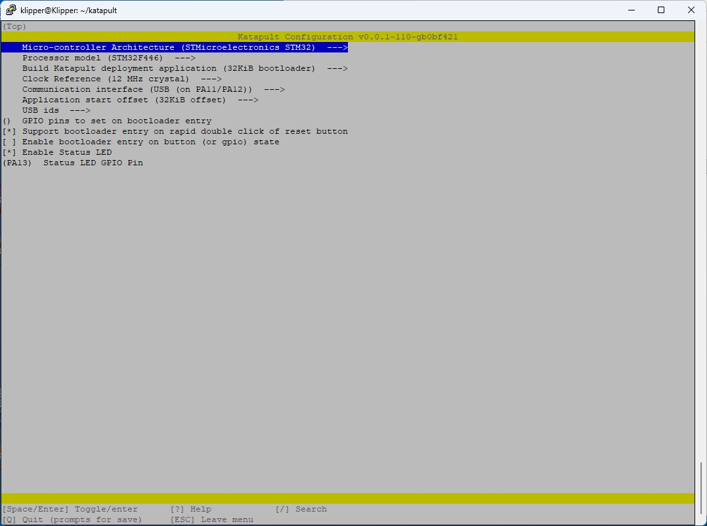
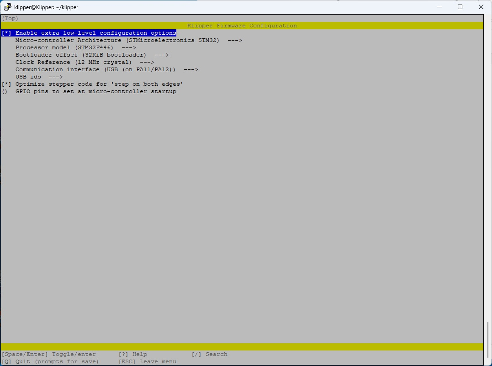
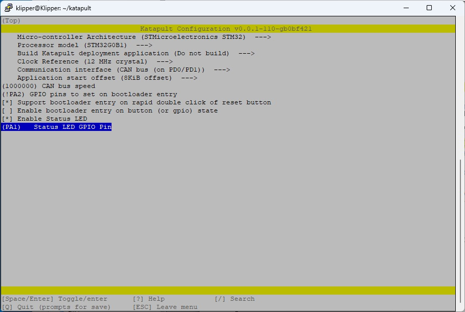
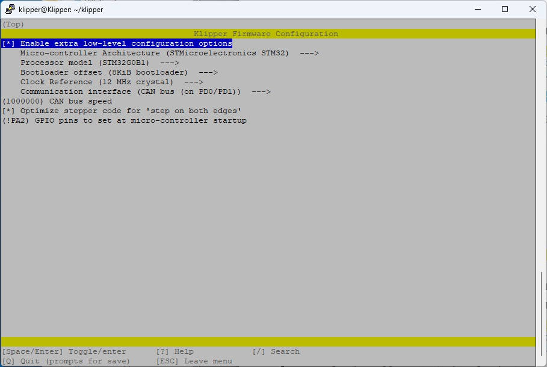
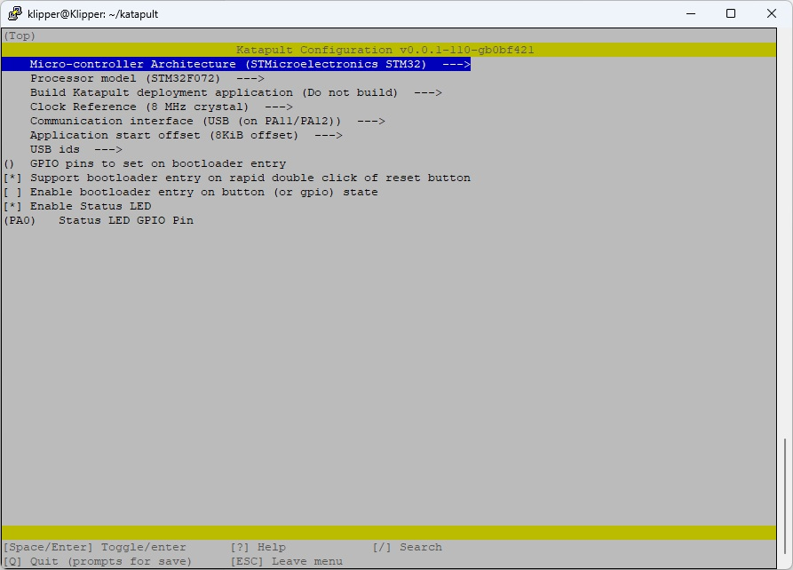
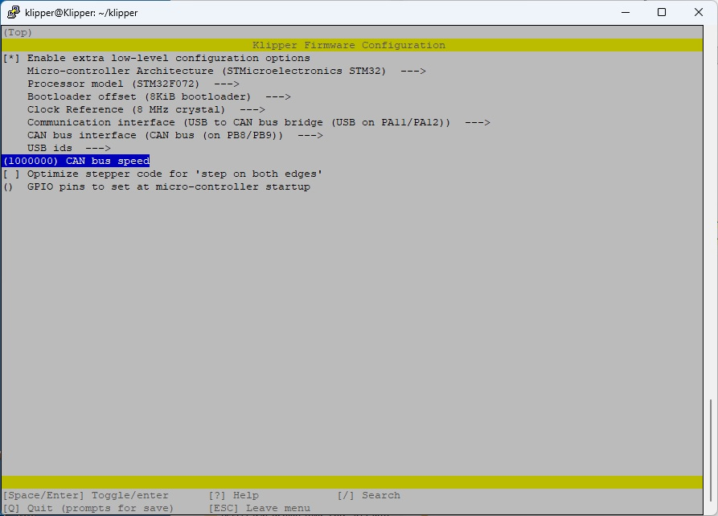

# Stop Klipper

Before firmware upgrades, please stop klipper services:

```sh
$ sudo systemctl stop klipper.service
$ sudo systemctl stop moonraker.service
```


# Install Firmware

## Octopus v1.1

Login as `klipper` user.

### Katapult

After ensuring *Klipper* and *moonraker* services are down, do:

- Short BOOT0 jumper (near the display connector)
- Press RESET button (border, near USB-C connector)

Confirm STM32 in DFU mode:

```sh
$ lsusb
```

You should find a *STM32 in DFU mode*.

```sh
$ cd ~/katapult
$ make menuconfig
```



Options:
- Microcontroller **STMicrocontroller STM32**
- Processor model **STM32F446**
- Build Katapult deployment: **Do not build**
- Clock Reference: **12 MHz**
- Communication Interface: **USB on PA11/PA12**
- Application start offset: **32KiB offset**
- Support bootloader entry on rapid double click **YES**
- Enable bootloader entry on button state **NO**
- Enable Status LED **YES**
- **PA13** Status LED


```sh
$ make -j6
$ make flash FLASH_DEVICE=0483:df11
```

- Wait to finish
- Remove BOOT0 jumper
- Press RESET twice in less than 500ms.

Check if the *OpenMoko* interface can be seen:

```sh
$ lsusb
```

Find your serial device:

```sh
$ ls /dev/serial/by-id/
usb-katapult_stm32f446xx_390044001551303432323631-if00
```


### Klipper

Configure Klipper:

```sh
$ cd ~/klipper
$ make menuconfig
```



Options:
- Enable extra low-level configuration **YES**
- Microcontroller **STMicrocontroller STM32**
- Processor model **STM32F446**
- Bootloader offset: **32KiB bootloader**
- Clock Reference: **12 MHz**
- Communication Interface: **USB on PA11/PA12**
- USB ids **None**
- Optimize stepper code for both edges **YES**
- GPIO Pins **None**


```sh
$ make -j6
# Please replace the device path according to your results on previous step
$ make flash FLASH_DEVICE=/dev/serial/by-id/usb-katapult_stm32f446xx_390044001551303432323631-if00
```

> Repeat this procedure every time you want to update your klipper firmware.

After upgrade check the new device name:

```sh
$ ls /dev/serial/by-id/
usb-Klipper_stm32f446xx_390044001551303432323631-if00
```

## FYSETC H36 Combo v1.3

In this particular hardware USB/CAN selection is done using electronic switches and commended through fixed firmware GPIO state on pin `PA2` of the MCU.  
This state has to be done on Katapult and Klipper firmware for best results.

For this activity login as `klipper` user.

### Katapult

Make sure that no umbilical cable is connected, only a USB-C cable from NanoPC-T4 to the H36 Combo board.  
Then:

- Press BOOT0 button
- Press RESET button and release.
- Keep BOOT0 button pressed for a couple of seconds

Confirm STM32 in DFU mode:

```sh
$ lsusb
```

You should find a *STM32 in DFU mode*.

```sh
$ cd ~/katapult
$ make menuconfig
```



Options:
- Microcontroller **STMicrocontroller STM32**
- Processor model **STM32G0B1**
- Build Katapult deployment: **Do not build**
- Clock Reference: **12 MHz**
- Communication Interface: **CAN bus on PD0/PD1**
- Application start offset: **8KiB offset**
- CAN bus speed **1000000**
- GPIO pins to set on bootloader entry **!PA2**
- Support bootloader entry on rapid double click **YES**
- Enable bootloader entry on button state **NO**
- Enable Status LED **YES**
- Status LED **PA1**


```sh
$ make -j6
$ make flash FLASH_DEVICE=0483:df11
```

- Wait to finish
- Press RESET twice in less than 500ms to enter Katapult bootloader.

Check if the *OpenMoko* interface can be seen:

```sh
$ lsusb
```


### Klipper

Configure Klipper:

```sh
$ cd ~/klipper
$ make menuconfig
```



Options:
- Enable extra low-level configuration **YES**
- Microcontroller **STMicrocontroller STM32**
- Processor model **STM32F446**
- Bootloader offset: **32KiB bootloader**
- Clock Reference: **12 MHz**
- Communication Interface: **USB on PA11/PA12**
- USB ids **None**
- Optimize stepper code for both edges **YES**
- GPIO Pins **None**


```sh
$ make -j6
```

Find your serial device:

```sh
$ ~/klippy-env/bin/python ~/klipper/scripts/canbus_query.py can0
Found canbus_uuid=2b53c68c7ce0, Application: Klipper
Total 1 uuids found
$ python3 ~/klipper/lib/canboot/flash_can.py -u 2b53c68c7ce0
```


## Mellow Fly-SHT36

### Katapult

Install Katapult according to instructions on the Mellow Wiki. These images are just ready to play with.


### Klipper

Configure Klipper:

```sh
$ cd ~/klipper
$ make menuconfig
```


Options:
- Enable extra low-level consfiguration **YES**
- Microcontroller **Raspberry Pi RP2040/RP235x**
- Processor model **rp2040**
- Bootloader offset: **16KiB bootloader**
- Clock Reference: **12 MHz**
- Communication Interface: **CAN bus**
- (**1**) CAN RX gpio number
- (**0**) CAN TX gpio number
- (**1000000**) CAN bus speed
- Optimize stepper code for both edges **YES**
- GPIO Pins **!gpio5**


```sh
$ make -j6
```

Identify CAN hardware and flash firmware:

```sh
$ ~/klippy-env/bin/python ~/klipper/scripts/canbus_query.py can0
Found canbus_uuid=3c3b99de2916, Application: Klipper
Total 1 uuids found
$ python3 ~/klipper/lib/canboot/flash_can.py -u 3c3b99de2916
```

> Repeat this procedure every time you want to update your klipper firmware.


## U-CAN CandleLight trunk (Recommended)

Distribution of **candleLight_fw** is very outdated. Meanwhile firmware supports USB dual buffering, which increases the throughput of the transfers minimizing jitter, which is critical in som CANBUS use cases.

### Getting Latest Firmware

```sh
$ cd ~
$ git clone https://github.com/candle-usb/candleLight_fw.git
$ cd ~/candleLight_fw
```

### Compiling Latest Firmware

```sh
$ mkdir build
$ cd build
$ cmake .. -DCMAKE_TOOLCHAIN_FILE=../cmake/gcc-arm-none-eabi-8-2019-q3-update.cmake
$ make -j6 FYSETC_UCAN_fw
```

### Flashing

#### Enter DFU using jumpers

The best method is when you have access to the hardware is to short circuit **B0** and **3V3** and connect the USB-C cable. This will enter *STM32 DFU mode*.

#### Enter DFU using `dfu-util`

The other way is using `dfu-util`, which doesn't work as designed, probably because of how the firmware was implemented. 

One way I found is to make device enter DFU while in the *OpenMoko* device ID.

```sh
sudo dfu-util --dfuse-address -d1d50:606f -c 1 -i 0 -a 0 -s 0x08000000 -D FYSETC_UCAN_fw.bin
sudo dfu-util -d1d50:606f -c 1 -i 1 -a 0 -e
```


## U-CAN Klipper firmware

Instead of can it is recommended to use Klipper USB2CAN implementation


### katapult

In `klipper` user:

```sh
$ sudo systemctl stop klipper.service
$ sudo systemctl stop moonraker.service
$ lsusb
```

- Short BOOT0 jumper
- Short RESET jumper

Confirm STM32 in DFU mode:

```sh
$ lsusb
```

```sh
$ cd ~/katapult
$ make menuconfig
```



Options:
- Microcontroller **STMicrocontroller STM32**
- Processor model **STM32F072**
- Build Katapult deployment: **Do not build**
- Clock Reference: **8 MHz**
- Communication Interface: **USB on PA11/PA12**
- Application start offset: **8KiB offset**
- USB IDs **None**
- Support bootloader entry on rapid double click **YES**
- Enable bootloader entry on button state **NO**
- Enable Status LED **YES**
- **PA0** Status LED


```sh
$ make -j6
$ make flash FLASH_DEVICE=0483:df11
```

- Wait to finish
- Disconnect BOOT0 jumper
- Short RESET twice in less than 500ms.

Check if the *OpenMoko* interface can be seen:

```sh
$ lsusb
```

Find your serial device:

```sh
$ ls /dev/serial/by-id/
usb-katapult_stm32f072xb_32001E000A53594731383520-if00
```

### Klipper: USB-to-CAN Bridge


Configure Klipper:

```sh
$ cd ~/klipper
$ make menuconfig
```



Options:
- Enable extra low-level consfiguration **YES**
- Microcontroller **STMicrocontroller STM32**
- Processor model **STM32F072**
- Bootloader offset: **8KiB bootloader**
- Clock Reference: **8 MHz**
- Communication Interface: **USB to CAN bus bridge on PA11/PA12**
- CAN bus interface **on PB8/PB9**
- USB ids **None**
- Optimize stepper code for both edges **NO**
- GPIO Pins **None**


```sh
$ make -j6
$ cd out
# Please replace the device path according to your results on previous step
$  python3 ~/katapult/scripts/flashtool.py -d /dev/serial/by-id/usb-katapult_stm32f072xb_32001E000A53594731383520-if00 -f klipper.bin
```

> Repeat this procedure every time you want to update your klipper firmware.

After upgrade check the new device name:

```sh
$ lsusb
Bus 006 Device 006: ID 1d50:606f OpenMoko, Inc. Geschwister Schneider CAN adapter
$ ip a
1: lo: <LOOPBACK,UP,LOWER_UP> mtu 65536 qdisc noqueue state UNKNOWN group default qlen 1000
    link/loopback 00:00:00:00:00:00 brd 00:00:00:00:00:00
    inet 127.0.0.1/8 scope host lo
       valid_lft forever preferred_lft forever
    inet6 ::1/128 scope host noprefixroute
       valid_lft forever preferred_lft forever
2: eth0: <NO-CARRIER,BROADCAST,MULTICAST,UP> mtu 1500 qdisc mq state DOWN group default qlen 1000
    link/ether 3a:9f:cb:2c:d0:ea brd ff:ff:ff:ff:ff:ff
3: can0: <NOARP,UP,LOWER_UP,ECHO> mtu 16 qdisc fq_codel state UP group default qlen 128
    link/can
4: wlan0: <BROADCAST,MULTICAST,SLAVE,UP,LOWER_UP> mtu 1500 qdisc fq_codel master bond0 state UP group default qlen 1000
    link/ether 08:fb:ea:57:a2:78 brd ff:ff:ff:ff:ff:ff
5: bond0: <BROADCAST,MULTICAST,MASTER,UP,LOWER_UP> mtu 1500 qdisc noqueue state UP group default qlen 1000
    link/ether 08:fb:ea:57:a2:78 brd ff:ff:ff:ff:ff:ff
    inet 192.168.0.20/24 brd 192.168.0.255 scope global noprefixroute bond0
       valid_lft forever preferred_lft forever
    inet6 fe80::25c5:9ae2:e461:9354/64 scope link noprefixroute
       valid_lft forever preferred_lft forever
```


# Restart Start Klipper:

After firmware upgrades you can restart Klipper:

```sh
$ sudo systemctl start klipper.service
$ sudo systemctl start moonraker.service
```
