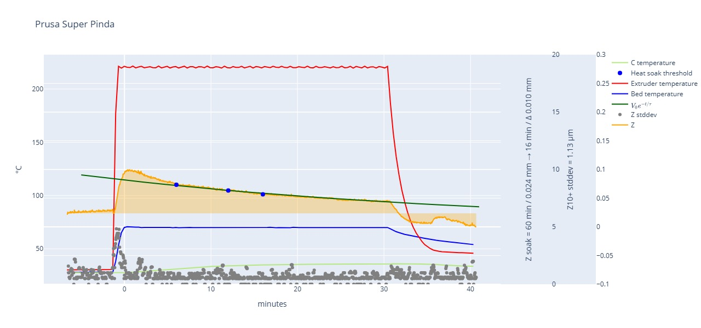
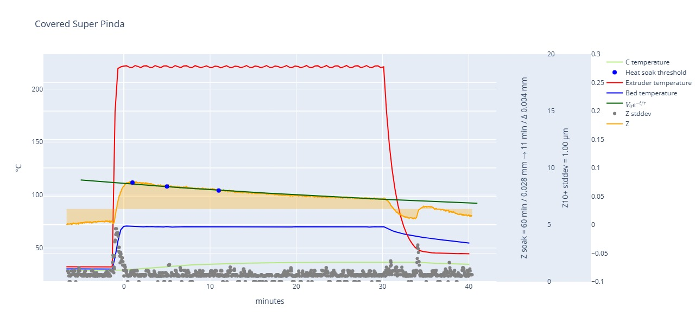
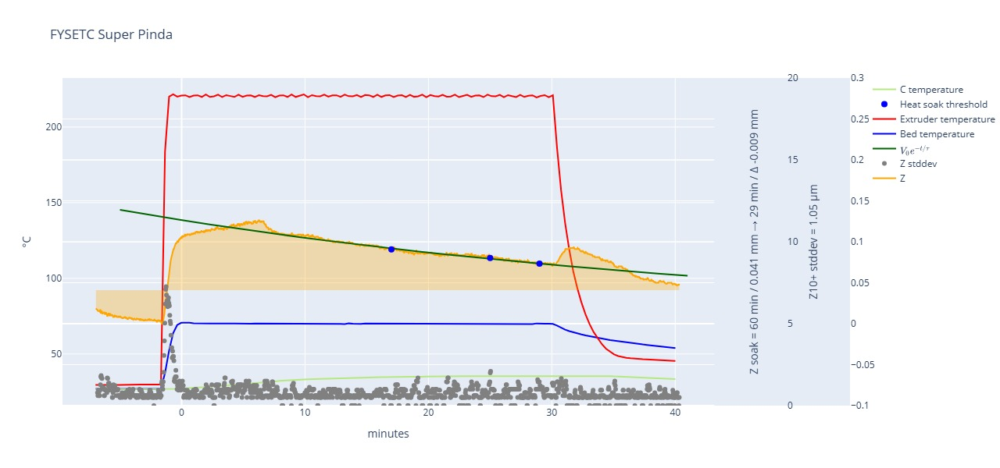
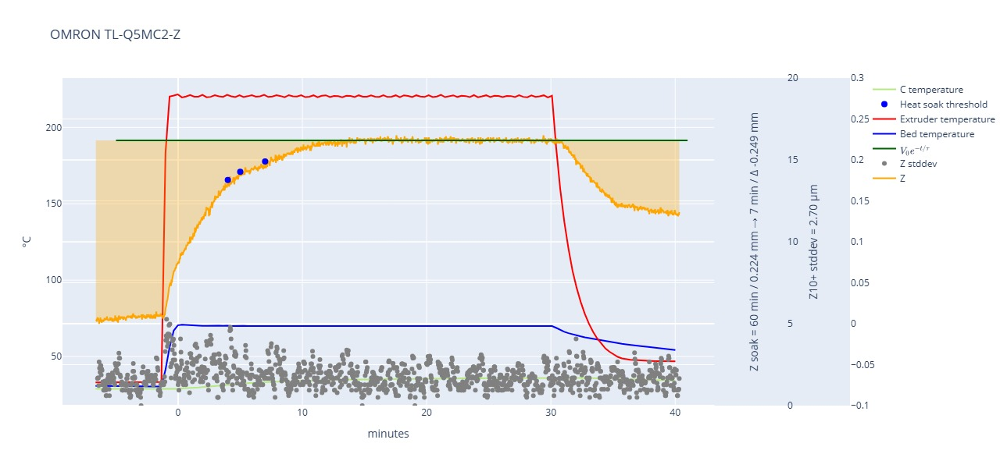
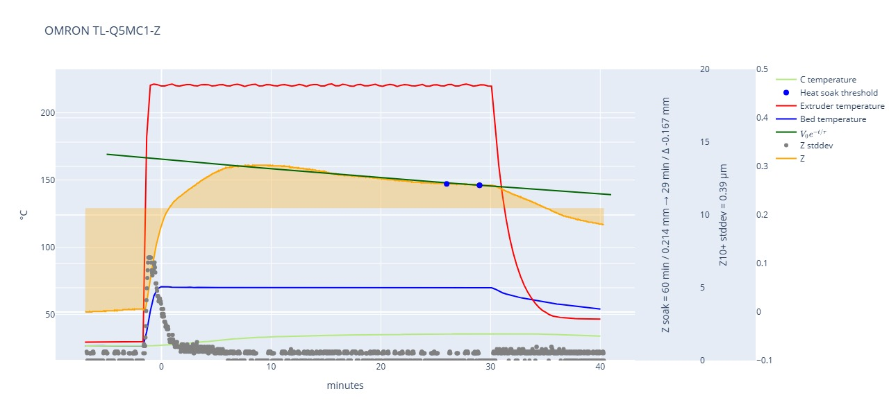
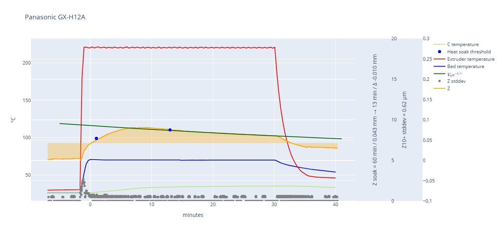
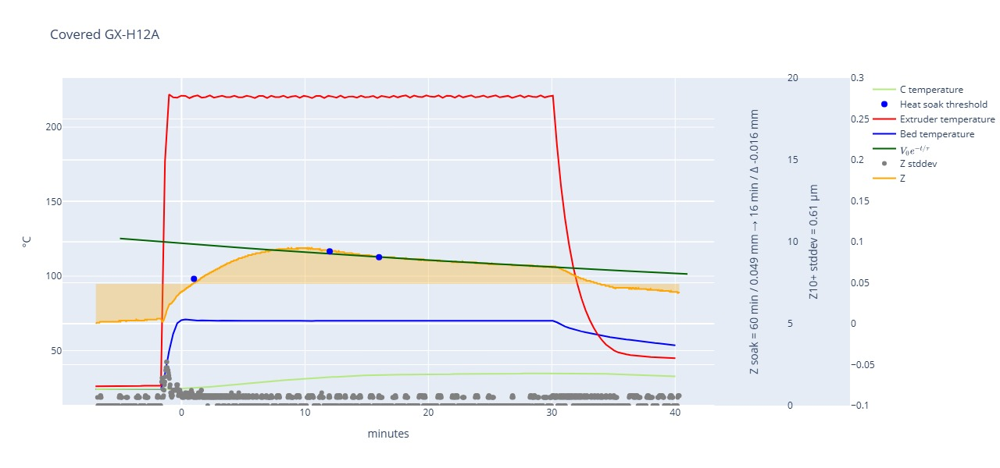
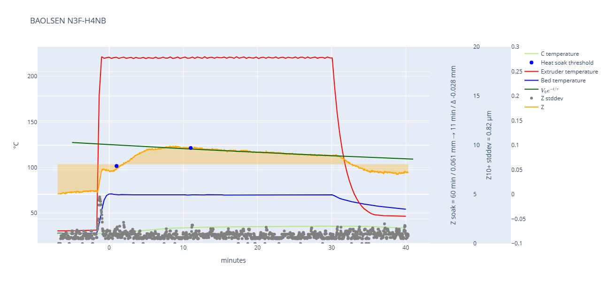

# Inductive Z-Probe Thermal Stability & Performance Report

This report evaluates various inductive sensors used for 3D printer Z-probing. Inductive sensors are sensitive to temperature changes; as the heat bed and nozzle warm up, the sensor's internal circuitry and the physical expansion of the printer affect the "trigger point."

## Testing Methodology

The sensors were put through a four-phase test procedure to measure drift and precision:

1. **Phase 1: Cold State** (5 minutes) – Baseline at ambient temperature.
2. **Phase 2: Heating** – Bed and Hot-end reaching working temperature.
3. **Phase 3: Heat Soaking** (30 minutes) – Measuring the stabilization pattern.
4. **Phase 4: Cool Down** (10 minutes) – Observing the return to ambient.

* * *

## Comparative Sensor Analysis

The following table summarizes the key performance metrics and physical characteristics of the tested probes.

| **Sensor** | **Type** | **Price** | **Soak Time\*** | **Z @ 60min** | **Pros** | **Cons** |
| --- | --- | --- | --- | --- | --- | --- |
| **Panasonic GX-H15A** | NPN NO | €39.00 | **1 min** | 0.109 mm | Incredible thermal stability. | Higher price point. |
| **Prusa Super Pinda** | 5V | €26.00 | 17 min | 0.024 mm | Proven reliability; good compensation. | Requires 5V interfacing. |
| **Panasonic GX-H12A** | NPN NO | €27.00 | 15 min | 0.042 mm | Very high precision (lowest StdDev). | NO logic risk. |
| **BAOLSEN N3F-H4NB** | NPN NC | €14.00 | 12 min | 0.061 mm | Best "budget" performance. | Quality control may vary. |
| **FYSETC Super Pinda** | 5V | €17.00 | 29 min | 0.042 mm | Affordable alternative to Prusa. | Slowest to stabilize. |
| **OMRON TL-Q5MC2-Z** | NPN NC | €67.00 | 7 min | 0.224 mm | Fast "stabilization." | **No compensation circuit.** |
| **OMRON TL-Q5MC1-Z** | NPN NO | €67.00 | 29 min | 0.213 mm | High build quality. | Poor thermal performance. |

*\* Soak Time is the duration required to reach a drift of &lt; 0.033mm (1/6th of a 0.2mm layer).*

## Key Findings & Guidance

### 1. The "Normally Open" (NO) vs. "Normally Closed" (NC) Trade-off

- **Precision:** Data suggests NO sensors (like the Panasonic GX series) tend to be more precise.
- **Safety:** **NC (Normally Closed)** sensors are recommended for 3D printers. If a wire breaks or a connector fails, the printer perceives a "triggered" state and stops. With an **NO** sensor, a failure will result in the printer driving the nozzle into the heat bed.

### 2. The Importance of Heat Soaking

The "Z Value Displacement" data proves that all inductive probes require a systematic heat soaking period. Even the best sensors showed a displacement between 0.020mm and 0.263mm from cold to hot. **Never probe a cold bed if you intend to print on a hot one.**

### 3. Thermal Compensation Circuits

The **Prusa Super Pinda** and **Panasonic** sensors utilize internal temperature compensation. In contrast, the **OMRON TL-Q5MC2-Z** shows a nearly horizontal curve in extrapolation tests. While this looks "stable," it actually reveals the absence of a compensation circuit. This means the sensor will require a complete recalibration if you change your bed temperature (e.g., switching from PLA at 60°C to PETG at 80°C).

### 4. Enclosures (Covered vs. Uncovered)

Testing "Covered" versions of the Super Pinda and GX-H12A showed that mounting the sensor in an enclosed support can slightly alter the thermal curve, often slowing the heat absorption but occasionally helping with consistency in drafty environments.

* * *

## Technical Data Summary

### Overall Error (No Systematic Calibration)

For users who do **not** use a heat-soaking routine, the following table illustrates the expected random error (Sample Difference) and consistency (Standard Deviation) across all phases.

| **Z-Probe** | **Sample Diff (µm)** | **Std Dev (µm)** |
| --- | --- | --- |
| Prusa Super Pinda | 100.00 | 25.26 |
| Panasonic GX-H12A | 81.25 | 24.13 |
| OMRON TL-Q5MC1-Z | 302.50 | 91.69 |

**Note on OMRON Sensors:** Due to the extreme performance difference between the MC1 and MC2 variants sourced from China, it is suspected these may be clones. It is advised to purchase from reputable distributors like Mouser or DigiKey if using OMRON for mission-critical leveling.

## Thermal Stabilization Analysis

The speed at which a sensor settles is critical for print efficiency. The following data derived from the "Z Value Evolution" table shows how many micrometers the trigger point shifts per minute as the sensor heats up.

### Stabilization Velocity (µm/min)

| **Z-Probe** | **1-2 Min** | **5-7 Min** | **15-20 Min** |
| --- | --- | --- | --- |
| **Panasonic GX-H15A** | 13.375 | 3.333 | -0.650 |
| **Prusa Super Pinda** | -5.125 | -2.792 | -1.125 |
| **OMRON TL-Q5MC2-Z** | 27.667 | 6.437 | -0.233 |
| **FYSETC Super Pinda** | 3.583 | 1.292 | -1.992 |

### Key Takeaways from the Data

- **Fastest Settling:** The **Panasonic GX-H15A** shows an extremely rapid reduction in drift velocity, reaching near-zero movement faster than any other sensor.
- **The "Overshoot" Effect:** Both **Prusa** and **Panasonic** sensors exhibit a "rebound" effect where the Z-value begins to move in the opposite direction (negative µm/min) after approximately 10–15 minutes. This indicates the active thermal compensation circuit is counteracting the physical expansion of the printer.
- **Clone Performance:** The **FYSETC Super Pinda** takes nearly twice as long as the original Prusa to reach a stable state, confirming that lower-cost alternatives often sacrifice the quality of the compensation components.

* * *

## Total Displacement (Cold to Hot)

This table shows the total distance (in mm) the probe's trigger point shifted from the initial cold state to the 25-minute mark.

| **Z-Probe** | **Total Shift (mm)** |
| --- | --- |
| **OMRON TL-Q5MC1-Z** | 0.263 mm |
| **OMRON TL-Q5MC2-Z** | 0.217 mm |
| **Panasonic GX-H15A** | 0.120 mm |
| **Prusa Super Pinda** | 0.020 mm |

### Impact on Print Quality

- **Layer 1 Reliability:** For a standard 0.2mm layer, a shift of **0.263 mm** (as seen in the OMRON MC1) is enough to cause a total print failure or a head crash if the printer isn't heat-soaked.
- **The Gold Standard:** The **Prusa Super Pinda** remains the most "stable" in terms of total displacement (only 0.020 mm), making it very forgiving even if your soak time is inconsistent.

* * *

## Summary Recommendation

For the best balance of safety and speed, the **Panasonic GX-H15A** is the top performer due to its 1-minute stabilization time. However, for those on a budget, the **BAOLSEN N3F-H4NB** offers a respectable 12-minute soak time at a fraction of the cost.

<head></head>
### Z Value Evolution Analysis

The following data tracks how rapidly the sensors change their readings over time, expressed in $\mu m/min$. A value closer to zero indicates a stabilized, reliable thermal state:

- **Initial Phase (0–2 Min):** High volatility is observed, particularly in the OMRON sensors, which showed shifts as high as 74.77 $\mu m/min$.
- **Mid-Phase (3–7 Min):** The Prusa and Covered Super Pinda models show aggressive stabilization, often dropping below 3 $\mu m/min$ of drift.
- **Late-Phase (15–25 Min):** Most sensors, including the Panasonic series, demonstrate excellent stability, consistently staying below 1 $\mu m/min$ of drift, indicating they have reached a "thermal steady state".

### Interpretation of Performance

When analyzing the evolution of these values, consider these points for your wiki:

- **Rapid vs. Gradual Stabilization:** Sensors like the **Panasonic GX-H12A** show consistent, predictable decay in drift rates, making them easier to compensate for in firmware.
- **The OMRON Variance:** The extremely high evolution rates in the OMRON sensors (e.g., 74.77 $\mu m/min$ initially) confirm that they are not optimized for the thermal environment of a 3D printer bed.
- **Systematic Soak Requirement:** The derivative data confirms that no sensor is "instant-on." All probes show significant movement in the first 7 minutes, underscoring the requirement for a systematic heat-soaking routine prior to auto-leveling.

## The "Covered" Effect: Housing vs. Open Air

Your tests show that adding a cover or enclosure generally alters the thermal inertia and the final stability point of the sensors.

| **Sensor Comparison** | **Any Soak Shift (mm)** | **Soak Time to Stability** | **Final Z @ 25min (mm)** |
| --- | --- | --- | --- |
| **Prusa Super Pinda** | 0.036 | 17 min | 0.047 |
| **Covered Super Pinda** | 0.054 | **12 min** | 0.049 |
| **FYSETC Super Pinda** | 0.089 | 29 min | 0.083 |
| **Covered FYSETC** | 0.106 | 29 min | 0.093 |
| **Panasonic GX-H12A** | 0.064 | 15 min | 0.065 |
| **Covered GX-H12A** | 0.073 | 17 min | 0.073 |

### Observations on Airflow & Shielding

- **Super Pinda Improvement:** Interestingly, the **Covered Super Pinda** stabilized **5 minutes faster** (12 min vs 17 min) than the open version. This supports your theory that shielding the sensor from turbulent air helps it reach a steady internal temperature more quickly.
- **Precision (StdDev):** The **Covered GX-H12A** maintained a very low Standard Deviation in Phase 3 (1.24 µm), nearly identical to its uncovered counterpart (1.18 µm). This suggests that while covers change the *timing* of the drift, they don't necessarily degrade the mechanical precision of the pulse.
- **Increased Displacement:** In almost all cases (Super Pinda, FYSETC, and GX-H12A), the "Covered" version showed a slightly **higher total Z displacement** at the 25-minute mark compared to the uncovered version. This is likely because the cover traps heat, allowing the sensor body to reach a higher absolute temperature than it would if it were being cooled by ambient airflow.

# Graphic for Sensors

## SuperPinda (Prusa / Pepperl&Fuchs)

If the sensor holder significantly covers the sensor, we have the following graph:

### Info

- **Price:** €26.00
- **Web:** https://www.prusa3d.com/product/superpinda/
- **Recommended heat soaking time:** 12 or 17 minutes, depending on the holder we use.

### Pros

- Max error below 1/2 layer height (for uncalibrated use)
- Very stable
- Well supported form factor

### Cons
- 5V Power Supply
- 2.5 mm sensing distance
- Difficult to fix and adjust
- Cable is too hard and difficult to route in compact tool-head

### Comments

Way to go if you don't bother with the short sensing distance.

## SuperPinda (FYSETC clone)

If the sensor holder significantly covers the sensor, we have the following graph:

### Info

- **Price:** €17,00
- **Web:** https://de.aliexpress.com/item/1005004421450006.html
- **Recommended heat soaking time:** 29 minutes

### Pros

- Price
- Well supported form factor
- Deviation is half of the layer height, without heat soaking

### Cons

- 5V Power Supply
- Max error above 1/2 layer height (for uncalibrated use)
- 2.5 mm sensing distance
- Difficult to fix and adjust
- Cable is too hard and difficult to route in compact tool-head

### Comments

In many aspects this Z-Probe is a fine replacement for the original parts, specially if considering the price difference.

## OMRON TL-Q5MC2-Z

### Info

- **Price:** €67,00
- **Web:** https://www.mouser.at/ProductDetail/Omron-Automation-and-Safety/TL-Q5MC2?qs=SZDmkwkWGmleKATVw1kKHA%3D%3D
- **Recommended heat soaking time:** 7 minutes (see problem below)

### Pros

- 5mm sensing distance
- Easy to fit into toolhead
- Voron standard

### Cons

- Max error above a layer height (for uncalibrated use)
- Price on official reseller are very high
- No temperature compensation circuit, which means that every bed temperature requires a new calibration.
- Cable is too hard and difficult to route in compact tool-head
- Device can be a fake part

### Comments

This is the official Z-probe used on Voron printer. I cannot recommend this part, since Z changes are as big as one layer. Heat soaking is the only feasible way to use this component. The first impression is that the device is the most linear component of all that has been tested. But this proves that it has no temperature compensation circuit. As a consequence, every heat bed temperature will require a new Z offset calibration. I see no reason for Voron Team recommending this configuration.

## OMRON TL-Q5MC1-Z

Because the behavior of this sensor is quite different than its complementary, I am inclined to consider one of the parts *probably fake* device. One came with the Voron Kit (A Chinese source, at the end). Both sensors were packaged nearly identical bags. I definitely will not spend €67 bucks on an device of a trusted reseller, just to prove this assumption.

### Info

- **Price:** €67,00
- **Web:** https://www.mouser.at/ProductDetail/Omron-Automation-and-Safety/TL-Q5MC1?qs=NA0XKeglvRXL5g2iJn2Z1g%3D%3D
- **Recommended heat soaking time:** 29 minutes

### Pros

- 5mm sensing distance
- Easy to fit into toolhead

### Cons

- Max error above a layer height
- Print head crash on defective installation
- Price on official reseller are very high
- Cable is too hard and difficult to route in compact tool-head
- Device can be a fake part

### Comments

This is the complementary part offered by OMRON. Similarly it shows abysmal offsets on the Z value. Note that using the "push" feature of the NPN transistor produces more stable readings, but still does not improve for practical application.

Note that although stability of the reading NPN probes has the disadvantage that a nozzle crash happens if some electric connection of the Z-probe fails.

## Panasonic GX-H15A

### Info

- **Price:** €39,00
- **Web:** https://www.mouser.at/ProductDetail/Panasonic-Industrial-Automation/GX-H15A?qs=3Rah4i%252BhyCFexaV08Yu2hw%3D%3D
- **Recommended heat soaking time:** 1 minute

### Pros

- 5mm sensing distance
- Best product on this distance sensing
- Very flexible cable
- Easy to fit into toolhead

### Cons

- Max error above 1/2 layer height (for uncalibrated use)
- Print head crash on defective installation

### Comments

I bought this model, since it is from the same family of **Panasonic GX-H12A** and has the advantage of working with more distance.

## Panasonic GX-H12A

If a sensor holder significantly covers the sensor, we have the following graph:

> *This test shows that plastic holders causes negative effect on the Z-offset quality and heat soaking. When designing a probe holder for a sensor featuring temperature compensation, is to let it be mostly exposed.*

### Info

- **Price:** €27,00
- **Web:** https://www.mouser.at/ProductDetail/Panasonic-Industrial-Automation/GX-H12A?qs=3Rah4i%252BhyCGaWL%2F65F7Z2A%3D%3D
- **Recommended heat soaking time:** 15 minutes

### Pros

- Max error below 1/2 layer height
- 4mm sensing distance
- Best product on this distance sensing
- Very flexible cable
- Easy to fit into toolhead

### Cons

- Deviation can be more than a quarter layer height, without heat soaking.
- Print head crash on defective installation

### Comments

This is the way to go if you want more than 2.5mm sensing distance.

## BAOLSEN N3F-H4NB

### Info

- Price: €14,00
- Web: https://de.aliexpress.com/item/1005009091791915.html
- **Recommended heat soaking time:** 12 minutes

### Pros

- Max error below 1/2 layer height
- 4mm sensing distance
- Cheap option for umbilical setup
- Easy to fit into toolhead

### Cons

- Deviation can be more than a quarter layer height, without heat soaking.
- Bad experience with long cable harness

### Comments

This is a clone from **Panasonic GX-H12B** commonly found on some chinese 3D printers, like Artillery, Elegoo, SoVol and many other.

My old printer used it with a long cable and noise levels were too high in this situation.

# General Performance Tables

These tables views result in a more general form, not focusing a specific time spot. Each phase of the test was evaluated:
- Overall: Statistics for the entire process
- Phase 1: Statistics for the cold printer (5 minutes)
- Phase 2: Statistics for the warm up phase (until heat-bed reaches target temperature)
- Phase 3: Statistics while hot end and heat bed are stable and sensor is heat soaking (30 minutes)
- Phase 4: Statistics when hot-end and heat bed are turned off and printer cools down (5 minutes)

## Unfiltered Sample Results

This table takes all samples and evaluate statistics. It represents the error associated to use the probe at any random time, without a following a specific procedure.

### Sample Difference (µm)

| Z-Probe            | Overall | Phase 1 | Phase 2 | Phase 3 | Phase 4 |
|--------------------|:-------:|:-------:|:-------:|:-------:|:-------:|
| Prusa Super Pinda  |  100.00 |   10.00 |   68.75 |   56.25 |   45.00 |
| Covered Super Pinda|   76.25 |    7.50 |   66.25 |   31.25 |   37.50 |
| FYSETC Super Pinda |  126.25 |   16.25 |  106.25 |   56.25 |   47.50 |
| Covered FYSETC     |  141.25 |   11.25 |  107.50 |   56.25 |   55.00 |
| OMRON TL-Q5MC2-Z   |  230.00 |   15.00 |   67.50 |  156.25 |   95.00 |
| OMRON TL-Q5MC1-Z   |  302.50 |    6.25 |  172.50 |  123.75 |   81.25 |
| Panasonic GX-H15A  |  135.00 |    6.25 |   53.75 |   77.50 |   55.00 |
| Panasonic GX-H12A  |   81.25 |    3.75 |   41.25 |   40.00 |   31.25 |
| Covered GX-H12A    |   92.50 |    6.25 |   36.25 |   53.75 |   32.50 |
| BAOLSEN N3F-H4NB   |   98.75 |    8.75 |   48.75 |   53.75 |   41.25 |

### Standard Deviation (µm)

| Z-Probe            | Overall | Phase 1 | Phase 2 | Phase 3 | Phase 4 |
|--------------------|:-------:|:-------:|:-------:|:-------:|:-------:|
| Prusa Super Pinda  |   25.26 |    1.58 |   24.24 |   15.00 |   10.12 |
| Covered Super Pinda|   21.73 |    1.82 |   23.15 |    8.93 |    8.45 |
| FYSETC Super Pinda |   32.32 |    3.86 |   37.04 |   15.27 |   15.18 |
| Covered FYSETC     |   39.48 |    2.26 |   37.85 |   17.60 |   19.50 |
| OMRON TL-Q5MC2-Z   |   72.15 |    2.56 |   22.67 |   34.65 |   30.11 |
| OMRON TL-Q5MC1-Z   |   91.69 |    2.05 |   57.87 |   21.68 |   25.25 |
| Panasonic GX-H15A  |   41.91 |    1.76 |   18.60 |   14.25 |   16.03 |
| Panasonic GX-H12A  |   24.13 |    0.79 |   13.35 |    8.25 |    9.28 |
| Covered GX-H12A    |   26.98 |    1.26 |   11.67 |   10.78 |    9.05 |
| BAOLSEN N3F-H4NB   |   28.48 |    2.00 |   16.06 |   10.82 |   12.28 |

## Local Sampling Results

This data represents a local data sampling. This considers that Klipper takes a set of samples to compute a single Z value, which reduces noise, in comparison with the general tables.

### Sample Difference (µm)

| Z-Probe            | Overall | Phase 1 | Phase 2 | Phase 3 | Phase 4 |
|--------------------|:-------:|:-------:|:-------:|:-------:|:-------:|
| Prusa Super Pinda  |    2.67 |    2.04 |   17.78 |    2.02 |    3.19 |
| FYSETC Super Pinda |    3.34 |    2.65 |   22.04 |    2.80 |    2.63 |
| Covered FYSETC     |    3.21 |    1.09 |   22.44 |    2.86 |    2.67 |
| OMRON TL-Q5MC2-Z   |    7.02 |    5.63 |   18.67 |    6.96 |    6.67 |
| OMRON TL-Q5MC1-Z   |    2.94 |    0.74 |   34.91 |    1.86 |    2.41 |
| Panasonic GX-H15A  |    2.61 |    1.01 |   14.19 |    2.61 |    2.06 |
| Panasonic GX-H12A  |    1.18 |    0.44 |    8.35 |    0.93 |    1.21 |
| Covered GX-H12A    |    1.24 |    0.58 |    7.41 |    1.03 |    1.22 |
| BAOLSEN N3F-H4NB   |    3.25 |    2.60 |   11.31 |    2.85 |    3.59 |

### Standard Deviation (µm)

| Z-Probe            | Overall | Phase 1 | Phase 2 | Phase 3 | Phase 4 |
|--------------------|:-------:|:-------:|:-------:|:-------:|:-------:|
| Prusa Super Pinda  |    0.89 |    0.71 |    5.80 |    0.68 |    1.06 |
| FYSETC Super Pinda |    1.08 |    0.89 |    7.13 |    0.88 |    0.92 |
| Covered FYSETC     |    1.06 |    0.45 |    7.29 |    0.92 |    0.91 |
| OMRON TL-Q5MC2-Z   |    2.14 |    1.70 |    5.99 |    2.10 |    2.06 |
| OMRON TL-Q5MC1-Z   |    1.01 |    0.29 |   11.23 |    0.66 |    0.85 |
| Panasonic GX-H15A  |    0.86 |    0.40 |    4.59 |    0.84 |    0.71 |
| Panasonic GX-H12A  |    0.43 |    0.17 |    2.72 |    0.36 |    0.45 |
| Covered GX-H12A    |    0.46 |    0.22 |    2.43 |    0.39 |    0.47 |
| BAOLSEN N3F-H4NB   |    1.05 |    0.80 |    3.60 |    0.94 |    1.13 |

These tables proves that sampling multiple times makes even the worst probe work within good deviation, when applied to a *local* time spot.

# Heat Soaking Tables

The next set of tables will show how important heat soaking is.  
It focus on **Phase 3** of the previous tables: Instead sampling a random spot, if we apply a reasonable heat soaking time, the first layer results are more deterministic.

## Average Z Value (in mm)

These values are relative to the lowest Z offset found on the data set. Consider this reference as an ideal Z offset calibration for a cold printer. Since we want to prove that heat soaking is mandatory, here you can figure out how important is to calibrate the printer in heated condition.

| Z-Probe            | Any Soak | 0 Min  | 1 Min  | 2 Min  | 3 Min  | 5 Min  | 7 Min  | 10 Min | 15 Min | 20 Min | 25 Min |
|--------------------|:--------:|:------:|:------:|:------:|:------:|:------:|:------:|:------:|:------:|:------:|:------:|
| Prusa Super Pinda  |    0.058 |  0.062 |  0.075 |  0.074 |  0.072 |  0.068 |  0.066 |  0.063 |  0.056 |  0.051 |  0.049 |
| FYSETC Super Pinda |    0.097 |  0.093 |  0.108 |  0.112 |  0.115 |  0.121 |  0.123 |  0.108 |  0.096 |  0.086 |  0.083 |
| Covered FYSETC     |    0.112 |  0.097 |  0.112 |  0.117 |  0.121 |  0.130 |  0.136 |  0.138 |  0.116 |  0.101 |  0.093 |
| OMRON TL-Q5MC2-Z   |    0.201 |  0.068 |  0.098 |  0.126 |  0.148 |  0.179 |  0.192 |  0.213 |  0.224 |  0.223 |  0.224 |
| OMRON TL-Q5MC1-Z   |    0.272 |  0.131 |  0.205 |  0.235 |  0.252 |  0.283 |  0.299 |  0.302 |  0.290 |  0.276 |  0.266 |
| Panasonic GX-H15A  |    0.122 |  0.069 |  0.085 |  0.099 |  0.108 |  0.122 |  0.129 |  0.132 |  0.130 |  0.127 |  0.124 |
| Panasonic GX-H12A  |    0.068 |  0.034 |  0.046 |  0.054 |  0.062 |  0.073 |  0.080 |  0.080 |  0.074 |  0.069 |  0.065 |
| Covered GX-H12A    |    0.077 |  0.036 |  0.048 |  0.058 |  0.066 |  0.080 |  0.088 |  0.092 |  0.084 |  0.078 |  0.073 |
| BAOLSEN N3F-H4NB   |    0.084 |  0.048 |  0.051 |  0.061 |  0.071 |  0.089 |  0.093 |  0.095 |  0.090 |  0.086 |  0.082 |

## Z Value Offset To Extrapolation (in mm)

Based on the data we compute an exponential descending curve, that represents the effect of thermal compensation circuit. This function is extrapolated to 60min, which is considered here as the point when readings stabilize. The next table computes the difference of the average value to this extrapolated point.

| Z-Probe            | Extrapolation | Any Soak | 0 Min  | 1 Min  | 2 Min  | 3 Min  | 5 Min  | 7 Min  | 10 Min | 15 Min | 20 Min | 25 Min |
|--------------------|:-------------:|:--------:|:------:|:------:|:------:|:------:|:------:|:------:|:------:|:------:|:------:|:------:|
| Prusa Super Pinda  |        0.0277 |    0.030 |  0.035 |  0.047 |  0.046 |  0.045 |  0.041 |  0.038 |  0.035 |  0.028 |  0.024 |  0.021 |
| FYSETC Super Pinda |        0.0418 |    0.055 |  0.051 |  0.067 |  0.070 |  0.073 |  0.079 |  0.081 |  0.066 |  0.054 |  0.044 |  0.041 |
| Covered FYSETC     |        0.0503 |    0.062 |  0.047 |  0.062 |  0.067 |  0.071 |  0.079 |  0.086 |  0.088 |  0.066 |  0.050 |  0.042 |
| OMRON TL-Q5MC2-Z   |        0.2235 |   -0.022 | -0.156 | -0.125 | -0.098 | -0.076 | -0.044 | -0.031 | -0.011 |  0.001 | -0.000 |  0.001 |
| OMRON TL-Q5MC1-Z   |        0.2134 |    0.058 | -0.083 | -0.008 |  0.021 |  0.039 |  0.069 |  0.086 |  0.089 |  0.077 |  0.063 |  0.053 |
| Panasonic GX-H15A  |        0.1086 |    0.013 | -0.040 | -0.023 | -0.010 | -0.000 |  0.014 |  0.021 |  0.024 |  0.021 |  0.018 |  0.015 |
| Panasonic GX-H12A  |        0.0416 |    0.027 | -0.008 |  0.004 |  0.013 |  0.020 |  0.032 |  0.038 |  0.039 |  0.032 |  0.027 |  0.023 |
| Covered GX-H12A    |        0.0482 |    0.029 | -0.012 | -0.000 |  0.010 |  0.018 |  0.032 |  0.040 |  0.044 |  0.036 |  0.030 |  0.025 |
| BAOLSEN N3F-H4NB   |        0.0608 |    0.023 | -0.012 | -0.010 |  0.000 |  0.010 |  0.028 |  0.032 |  0.035 |  0.030 |  0.025 |  0.021 |

## Z Value Evolution (in µm/min)

This is an interesting table, which shows you the evolution of the drift caused by temperature exposure. Practical recommendation is to have offset variation below 1/4 of layer height.  
In general after 10 minutes the drift tends to stabilize and variations are subtle.

| Z-Probe            |  0-1 Min  |  1-2 Min  |  2-3 Min  |  3-5 Min  |  5-7 Min  | 7-10 Min  | 10-15 Min | 15-20 Min | 20-25 Min |
|--------------------|:---------:|:---------:|:---------:|:---------:|:---------:|:---------:|:---------:|:---------:|:---------:|
| Prusa Super Pinda  |    12.409 |    -0.833 |    -1.458 |    -1.954 |    -1.276 |    -1.004 |    -1.372 |    -0.917 |    -0.592 |
| FYSETC Super Pinda |    15.677 |     3.583 |     2.917 |     2.750 |     1.292 |    -5.014 |    -2.375 |    -1.992 |    -0.725 |
| Covered FYSETC     |    15.066 |     5.000 |     3.875 |     4.438 |     3.146 |     0.583 |    -4.392 |    -3.033 |    -1.608 |
| OMRON TL-Q5MC2-Z   |    30.262 |    27.667 |    21.750 |    15.937 |     6.437 |     6.903 |     2.275 |    -0.233 |     0.208 |
| OMRON TL-Q5MC1-Z   |    74.773 |    29.208 |    17.583 |    15.208 |     8.208 |     1.056 |    -2.375 |    -2.825 |    -2.058 |
| Panasonic GX-H15A  |    16.749 |    13.375 |     9.583 |     7.042 |     3.333 |     1.069 |    -0.475 |    -0.650 |    -0.642 |
| Panasonic GX-H12A  |    12.290 |     8.292 |     7.708 |     5.625 |     3.354 |     0.167 |    -1.308 |    -1.033 |    -0.806 |
| Covered GX-H12A    |    11.706 |    10.042 |     8.417 |     6.979 |     3.938 |     1.389 |    -1.717 |    -1.192 |    -0.925 |
| BAOLSEN N3F-H4NB   |     2.113 |    10.417 |     9.625 |     9.021 |     2.188 |     0.806 |    -0.992 |    -0.917 |    -0.731 |

## Z Value Displacement (Cold to Hot Values in mm)

This table proves that calibrating a printer at cold state is just a waste of time. It shown how much the Z value shifts between a cold system and a soaked probe. Consider that a default layer height is 0.2mm. You can easily tell that Z-offset should never be calibrated in a cold system, regardless of the probe you use. 

Official Voron probe can deviate more than a layer size and has clearly no temperature compensation. I am astonished, why this is the recommended part. 

| Z-Probe            | Any Soak | 0 Min  | 1 Min  | 2 Min  | 3 Min  | 5 Min  | 7 Min  | 10 Min | 15 Min | 20 Min | 25 Min |
|--------------------|:--------:|:------:|:------:|:------:|:------:|:------:|:------:|:------:|:------:|:------:|:------:|
| Prusa Super Pinda  |    0.054 |  0.058 |  0.071 |  0.070 |  0.068 |  0.065 |  0.062 |  0.059 |  0.052 |  0.048 |  0.045 |
| FYSETC Super Pinda |    0.089 |  0.085 |  0.101 |  0.104 |  0.107 |  0.113 |  0.115 |  0.100 |  0.088 |  0.078 |  0.075 |
| Covered FYSETC     |    0.106 |  0.091 |  0.106 |  0.111 |  0.115 |  0.124 |  0.130 |  0.132 |  0.110 |  0.095 |  0.087 |
| OMRON TL-Q5MC2-Z   |    0.194 |  0.061 |  0.091 |  0.119 |  0.140 |  0.172 |  0.185 |  0.206 |  0.217 |  0.216 |  0.217 |
| OMRON TL-Q5MC1-Z   |    0.269 |  0.128 |  0.202 |  0.232 |  0.249 |  0.280 |  0.296 |  0.299 |  0.287 |  0.273 |  0.263 |
| Panasonic GX-H15A  |    0.119 |  0.065 |  0.082 |  0.095 |  0.105 |  0.119 |  0.126 |  0.129 |  0.127 |  0.123 |  0.120 |
| Panasonic GX-H12A  |    0.064 |  0.030 |  0.042 |  0.050 |  0.058 |  0.069 |  0.076 |  0.077 |  0.070 |  0.065 |  0.061 |
| Covered GX-H12A    |    0.073 |  0.033 |  0.044 |  0.054 |  0.063 |  0.077 |  0.085 |  0.089 |  0.080 |  0.074 |  0.070 |
| BAOLSEN N3F-H4NB   |    0.079 |  0.044 |  0.046 |  0.056 |  0.066 |  0.084 |  0.088 |  0.091 |  0.086 |  0.081 |  0.078 |

> Even the best probe produces a significant layer shift.

## Standard Deviation (µm)

The classic standard deviation gives a picture of the noise average that is expected.

| Z-Probe            | Any Soak | 0 Min  | 1 Min  | 2 Min  | 3 Min  | 5 Min  | 7 Min  | 10 Min | 15 Min | 20 Min | 25 Min |
|--------------------|:--------:|:------:|:------:|:------:|:------:|:------:|:------:|:------:|:------:|:------:|:------:|
| Prusa Super Pinda  |    8.909 |  9.237 |  0.909 |  0.786 |  0.875 |  0.882 |  0.850 |  0.737 |  0.728 |  0.652 |  0.595 |
| FYSETC Super Pinda |   15.172 | 10.823 |  1.267 |  1.179 |  1.443 |  1.233 |  2.637 |  0.769 |  0.850 |  0.994 |  0.909 |
| Covered FYSETC     |   17.628 |  9.780 |  2.360 |  2.177 |  1.852 |  2.143 |  1.007 |  0.786 |  1.375 |  1.194 |  0.954 |
| OMRON TL-Q5MC2-Z   |   40.133 | 12.166 |  7.561 |  7.572 |  7.688 |  3.829 |  3.012 |  2.250 |  1.638 |  2.229 |  1.953 |
| OMRON TL-Q5MC1-Z   |   33.999 | 32.396 | 12.676 |  5.636 |  4.737 |  3.732 |  1.161 |  0.500 |  1.028 |  1.021 |  0.529 |
| Panasonic GX-H15A  |   14.249 |  5.918 |  4.114 |  3.369 |  2.886 |  1.677 |  0.812 |  0.747 |  0.913 |  0.692 |  0.567 |
| Panasonic GX-H12A  |   10.323 |  5.279 |  2.424 |  2.343 |  2.179 |  1.315 |  0.602 |  0.602 |  0.624 |  0.000 |  0.523 |
| Covered GX-H12A    |   12.436 |  4.353 |  2.996 |  2.820 |  2.370 |  1.603 |  1.057 |  0.425 |  0.456 |  0.529 |  0.624 |
| BAOLSEN N3F-H4NB   |   11.869 |  1.427 |  2.898 |  2.775 |  3.365 |  2.085 |  0.940 |  0.921 |  1.037 |  0.672 |  0.896 |

*In general if a system is calibrated on a very specific time spot, from a common starting temperature, every Z-probe is able to produce a decent first layer. Prusa and Panasonic are really more stable than other models and Panasonic tends to be better after enough soaking, since its sensing distance is bigger, requiring less mechanical trimming to apply it.*

## Amplitude Difference (µm)

The min an max Z values, may contaminate single samples, causing spurious hill or valleys.

| Z-Probe            | Any Soak | 0 Min  | 1 Min  | 2 Min  | 3 Min  | 5 Min  | 7 Min  | 10 Min | 15 Min | 20 Min | 25 Min |
|--------------------|:--------:|:------:|:------:|:------:|:------:|:------:|:------:|:------:|:------:|:------:|:------:|
| Prusa Super Pinda  |    33.75 |  31.25 |   2.50 |   3.75 |   2.50 |   3.75 |   3.75 |   2.50 |   2.50 |   2.50 |   2.50 |
| FYSETC Super Pinda |    60.00 |  40.00 |   5.00 |   5.00 |   6.25 |   3.75 |   8.75 |   2.50 |   2.50 |   5.00 |   3.75 |
| Covered FYSETC     |    66.25 |  33.75 |   8.75 |  10.00 |   6.25 |   7.50 |   3.75 |   2.50 |   5.00 |   5.00 |   3.75 |
| OMRON TL-Q5MC2-Z   |   183.75 |  41.25 |  26.25 |  31.25 |  31.25 |  15.00 |  13.75 |  10.00 |   8.75 |   8.75 |   7.50 |
| OMRON TL-Q5MC1-Z   |   231.25 | 107.50 |  43.75 |  18.75 |  16.25 |  12.50 |   3.75 |   1.25 |   3.75 |   2.50 |   1.25 |
| Panasonic GX-H15A  |    77.50 |  21.25 |  15.00 |  11.25 |  11.25 |   7.50 |   2.50 |   3.75 |   5.00 |   2.50 |   2.50 |
| Panasonic GX-H12A  |    56.25 |  16.25 |   8.75 |   8.75 |   6.25 |   3.75 |   2.50 |   1.25 |   2.50 |   0.00 |   1.25 |
| Covered GX-H12A    |    65.00 |  15.00 |  10.00 |  10.00 |   7.50 |   5.00 |   3.75 |   1.25 |   2.50 |   1.25 |   1.25 |
| BAOLSEN N3F-H4NB   |    53.75 |   6.25 |  10.00 |  11.25 |  11.25 |   7.50 |   3.75 |   3.75 |   3.75 |   2.50 |   2.50 |

*Some probes are useless without a considerable heat soaking. It is impressive how physical size of the sensor affects directly these values.*

# Conclusions

In general mechanical resolution of the Z axis, which is 1.25 µm, rules the standard deviation measured *locally* and a maximum drift of 1/4 of the layer height is a common sense on forums.

Some points can be listed:
- Not a single Probe should be used without heat soaking
- Prusa SuperPinda (**Warning:** 5V power supply!!) is the only exception that will produce decent results already with 3 minutes soaking.
- For OMRON probes, and if you still don't want to replace it, consider heat soaking for at least 7 minutes.
- For all other probes:
  - A coarse heat soaking routine should start sample at 3 minutes.
  - A acceptable heat soaking routine should sample at 5 minutes.
  - If you want a cheap option:
    - Go with SuperPinda FYSETC (**Warning:** 5V power supply!!)
	- Baolsen N3F-H4NB (easier to find) for umbilical setup only
	- Baolsen N3F-H4NA for long cable harness (untested, but should behave similar to complementary part)
- Switch distance of the sensor affects it's stability. SuperPinda is a 2.5mm sensor and shines on every test. 
- Panasonic is the way to go for 4mm or 5.5 mm sensors, which is also easier to adjust.
- Printers with umbilical setup can use complementary parts (*normally closed*) of the parts tested here. Shorter cables will keep noise levels in acceptable range. The advantage is that a defect on the sensor connection will not cause a head crash.  
In *normally open* sensors switching signal is very precise, but defective wiring will cause a head crash.
- The Baolsen Sensor is used on some printers from Artillery, Elegoo and Sovol, works quite good on an umbilical setup. But, my experience with them on longer cables was a deception.
- Voron Team should remove **TL-Q5MC2-Z** probe from their listing. For example, Panasonic **GX-H15A** has the same sensing distance as **TL-Q5MC2-Z** and is outstanding, with lower price.

