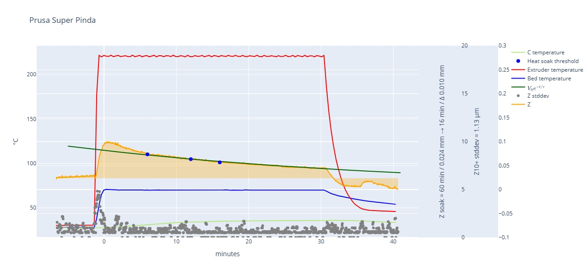
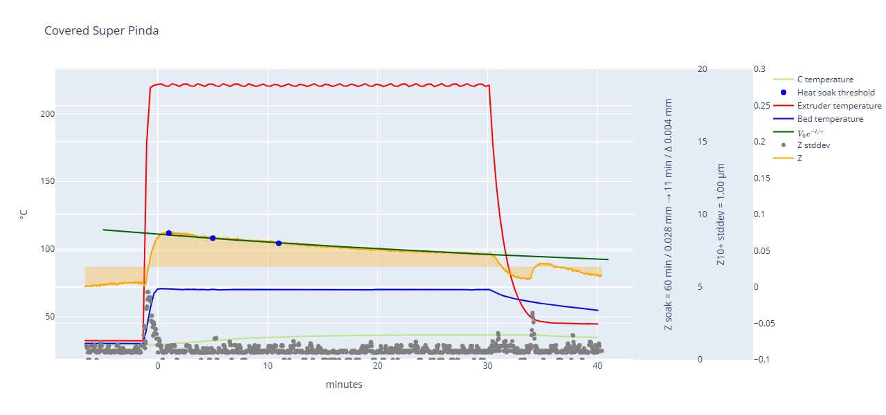
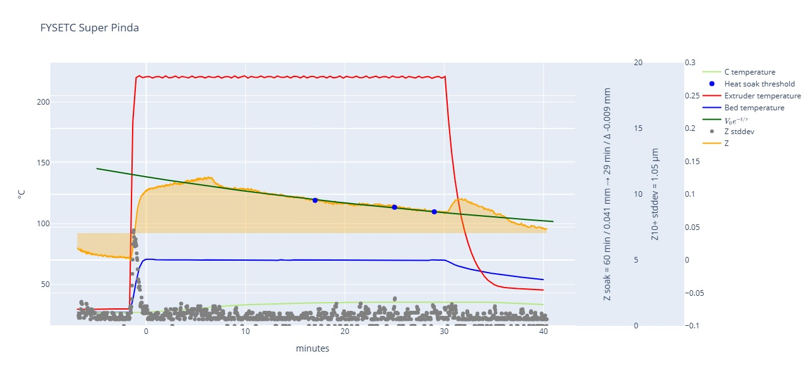
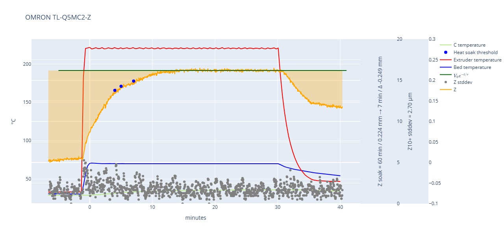
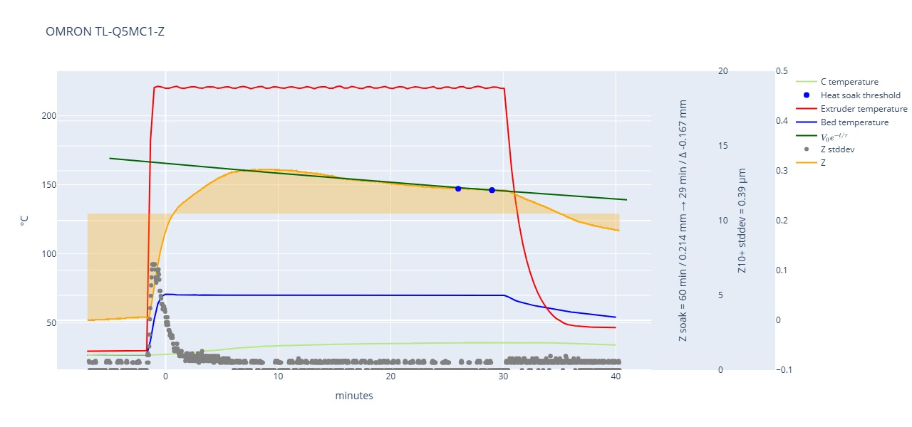
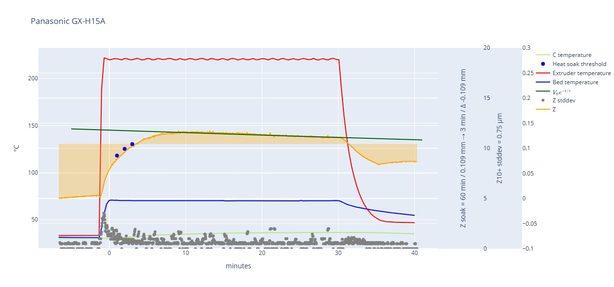
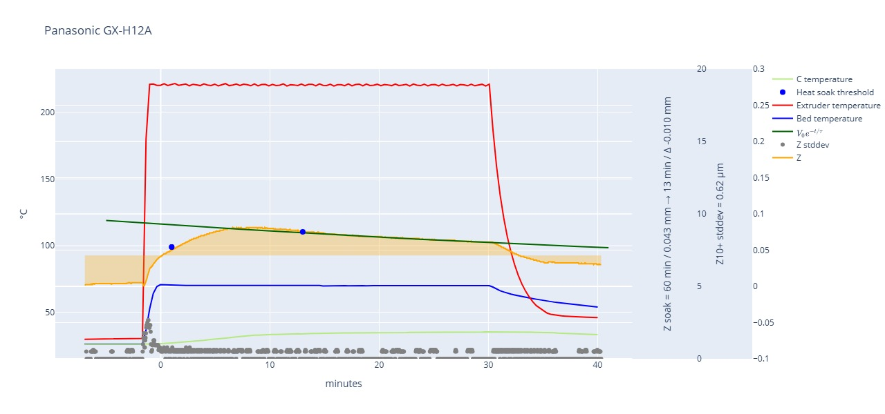
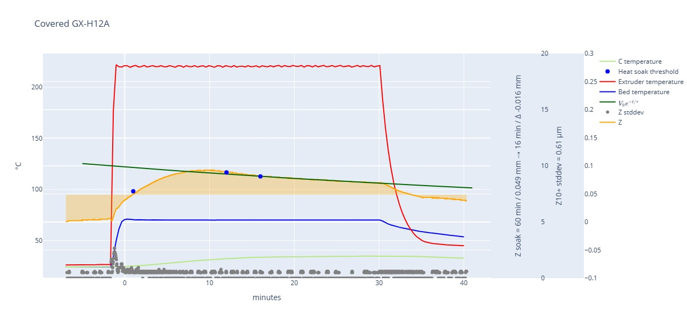
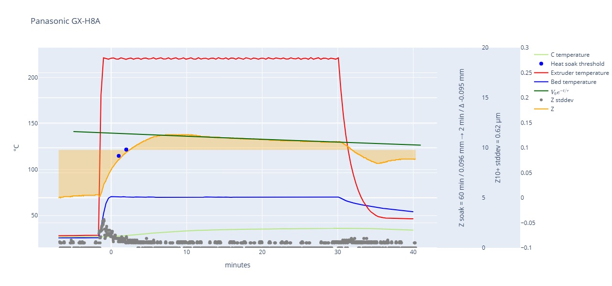
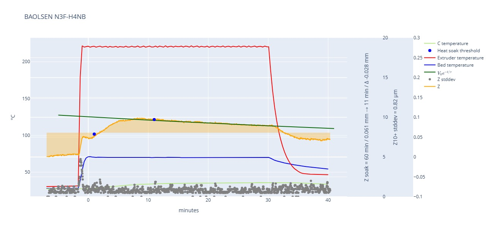

# Inductive Z-Probe Thermal Stability & Performance Report

This report evaluates inductive sensors for 3D printer Z-probing. Inductive sensors are highly susceptible to thermal drift; as the heat bed and nozzle warm up, the sensor's internal components and the printer's frame expand, shifting the "trigger point".

## Testing Methodology

Sensors were tested across four phases to measure drift and precision:

1. **Phase 1: Cold State** (5 min) – Baseline at ambient.
2. **Phase 2: Heating** – Reaching working temperatures.
3. **Phase 4: Cool Down** (10 min) – Return to ambient.
4. **Phase 3: Heat Soaking** (30 min) – Used to calculate the **Z-Offset Error** based on desired print quality.

### Quality Tiers (Based on 0.2mm Layer Height)

We categorize "Stability" by three error thresholds:

- **Normal:** Error ≈ 1/4 layer (0.050 mm).
- **Good:** Error ≈ 1/5 layer (0.040 mm).
- **Best:** Error ≈ 1/6 layer (0.033 mm).

* * *

## Comparative Sensor Analysis

The following table summarizes the key performance metrics and physical characteristics of the tested probes.

| **Sensor** | **Type** | **Price** | **Soak (Best)** | **Z @ 60min** | **Sensing Distance** | **Pros** | **Cons** |
| --- | --- | --- | --- | --- | --- | --- | --- |
| **Panasonic GX-H15A** | NO | €39.00 | **3 min** | 0.109 | 5mm | Extremely fast stabilization. | High price. |
| **Panasonic GX-H8A** | NO | €27,00 | **3 min** | 0.096 | 2.5 mm | Very fast; Compact | NO logic risk. |
| **Prusa Super Pinda** | 5V | €26.00 | 17 min | 0.024 | 2.5 mm | Most stable total displacement. | Requires 5V. |
| **Panasonic GX-H12A** | NO | €27.00 | 15 min | 0.043 | 4 mm | Highest mechanical precision. | NO logic risk. |
| **BAOLSEN N3F-H4NB** | NC | €14.00 | 12 min | 0.061 | 4 mm | Best budget stability. | NC safety. |
| **FYSETC Super Pinda** | 5V | €17.00 | 29 min | 0.041 | 2.5 mm | Affordable. | Very slow to soak. |
| **OMRON Q5MC1-Z** | NO | €67.00 | 29+ min | 0.214 | 5 mm |  | **Probably a chinese clone** |
| **OMRON Q5MC2-Z** | NC | €67.00 | 7 min | 0.224 | 5 mm | Fast "leveling." | **No compensation.** |

## Key Findings & Data Insights

### 1. Thermal Stabilization & "The Rebound"

The **Z Value Evolution** table shows how many μm the trigger point shifts per minute.

- **Active Compensation:** Sensors like the **Prusa Super Pinda** and **Panasonic** series exhibit a "rebound" (negative μm/min after ~10 mins), where the internal circuit actively fights the physical expansion of the printer.
- **The 2.5mm GX-H8A:** This new model performs similarly to the GX-H15A, reaching "Best" stability (0.0059 mm error) in just **3 minutes**.

### 2. Shielding and Enclosures (Covered vs. Uncovered)

Protecting the sensor from the airflow of the heat-break fan significantly impacts the "Soak Time" to reach stability:

- **Super Pinda:** Adding a cover reduced the "Best" soak time from **17 minutes to 12 minutes**.
- **GX-H12A:** The cover had a negligible effect on soak time (15 vs 17 mins) but maintained the sensor's industry-leading precision (1.03 μm Standard Deviation in Phase 3).

### 3. Z-Offset Error Trends

By using a min/max error calculation instead of absolute values, we see the true "window" of uncertainty.

- The **OMRON TL-Q5MC1-Z** remains the most problematic, failing to reach even "Normal" stability within the 29-minute testing window (0.0487 mm error at 29 min).
- The **Panasonic GX-H15A** reaches a near-perfect state (error of -0.0002 mm) in just 3 minutes.

* * *

## Summary for Users

If you prioritize **print start speed**, the **Panasonic GX-H15A or GX-H8A** are the clear winners, stabilizing in under 5 minutes. If you prioritize **long-term reliability and safety**, the **Prusa Super Pinda** (with a proper 5V interface) provides the most consistent Z-offset across the widest temperature range, especially when used with a 15-20 minute heat soak.

* * *

## Technical Data Summary

### Overall Error (No Systematic Calibration)

For users who do **not** use a heat-soaking routine, the following table illustrates the expected random error (Sample Difference) and consistency (Standard Deviation) across all phases.

| **Z-Probe** | **Sample Diff (µm)** | **Std Dev (µm)** |
| --- | --- | --- |
| Prusa Super Pinda | 100.00 | 25.26 |
| Panasonic GX-H12A | 81.25 | 24.13 |
| OMRON TL-Q5MC1-Z | 302.50 | 91.69 |

**Note on OMRON Sensors:** Due to the extreme performance difference between the MC1 and MC2 variants sourced from China, it is suspected these may be clones. It is advised to purchase from reputable distributors like Mouser or DigiKey if using OMRON for mission-critical leveling. Though, by that price tag, I would stick with a Panasonic model.

## Thermal Stabilization Analysis

The speed at which a sensor settles is critical for print efficiency. The following data derived from the "Z Value Evolution" table shows how many micrometers the trigger point shifts per minute as the sensor heats up.

### Stabilization Velocity (µm/min)

| **Z-Probe** | **1-2 Min** | **5-7 Min** | **15-20 Min** |
| --- | --- | --- | --- |
| **Panasonic GX-H15A** | 13.375 | 3.333 | -0.650 |
| **Prusa Super Pinda** | -6.083 | -2.583 | -1.117 |
| **OMRON TL-Q5MC2-Z** | 23.958 | 6.312 | -0.058 |
| **FYSETC Super Pinda** | 2.917 | -5.354 | -2.058 |

### Key Takeaways from the Data

- **Fastest Settling:** The **Panasonic GX-H15A** and **GX-H8A** shows an extremely rapid reduction in drift velocity, reaching near-zero movement faster than any other sensor.
- **The "Overshoot" Effect:** Both **Prusa** and **Panasonic** sensors exhibit a "rebound" effect where the Z-value begins to move in the opposite direction (negative µm/min) after approximately 10–15 minutes. This indicates the active thermal compensation circuit is counteracting the physical expansion of the printer.
- **Clone Performance:** The **FYSETC Super Pinda** takes nearly twice as long as the original Prusa to reach a stable state, confirming that lower-cost alternatives often sacrifice the quality of the compensation components.

* * *

## Total Displacement (Cold to Hot)

This table shows the total distance (in mm) the probe's trigger point shifted from the initial cold state to the 25-minute mark.

| **Z-Probe** | **Total Shift (mm)** |
| --- | --- |
| **OMRON TL-Q5MC1-Z** | 0.273 mm |
| **OMRON TL-Q5MC2-Z** | 0.197 mm |
| **Panasonic GX-H15A** | 0.119 mm |
| **Prusa Super Pinda** | 0.036 mm |

### Impact on Print Quality

- **Layer 1 Reliability:** For a standard 0.2mm layer, a shift of **0.273 mm** (as seen in the OMRON MC1) is enough to cause a total print failure or a head crash if the printer isn't heat-soaked.
- **The Gold Standard:** The **Prusa Super Pinda** remains the most "stable" in terms of total displacement (only 0.020 mm), making it very forgiving even if your soak time is inconsistent.

* * *

## Z-Offset Quality Options

This analysis breaks down the efficiency of each sensor based on your new **Normal/Good/Best** error thresholds. These ratios represent the time investment required to reach specific precision levels (1/4, 1/5, or 1/6 of a 0.2mm layer).

### 1. The "Efficiency" Ratio (Time to Precision)

The data reveals a massive divide between "Fast-Stabilizers" and "Slow-Soakers."

- **The Sprinters (Panasonic GX-H15A / GX-H8A):** These sensors reach the **Best** threshold (1/6 layer) in just **3 minutes**. Interestingly, they hit the **Normal** threshold almost immediately (1-2 mins), meaning there is very little "penalty" for demanding higher precision.
- **The Marathoners (Prusa Super Pinda / GX-H12A):** These require a significant time investment to move from **Normal** to **Best**.

    - **Super Pinda:** Jumps from 7 mins (Normal) to 17 mins (Best)—a **142% increase** in wait time for a 0.016mm improvement in error.
    - **GX-H12A:** Jumps from 1 min (Normal) to 15 mins (Best).
- **The Non-Conformists (OMRON / FYSETC):**

    - The **FYSETC** takes 29 minutes just to hit the **Best** mark, making it the least efficient "compensated" sensor.
    - The **OMRON MC1-Z** failed to reach any of the three quality tiers within the 29-minute test window, showing a persistent error of 0.0487mm.

* * *

### 2. Sensor Option Categorization

<head></head>

| **Category** | **Top Recommendation** | **Why?** |
| --- | --- | --- |
| **Speed & Throughput** | **Panasonic GX-H15A / H8A** | Reaches "Best" quality (0.0002mm to 0.0098mm error) in only **3 minutes**. Ideal for "print-and-go" workflows. |
| **Set-and-Forget** | **Prusa Super Pinda** | While it takes 17 mins to reach "Best," its **total displacement** is the lowest (0.020mm). Even if you forget to soak, your crash risk is minimal. |
| **Pure Precision** | **Panasonic GX-H12A** | Boasts the lowest Standard Deviation (0.36 $\mu m$). If your holder can block heat-break airflow, this is the most "repeatable" pulse. |
| **Budget Safety** | **BAOLSEN N3F-H4NB** | Reaches "Best" in 11 minutes (same as the Super Pinda) for only €14.00, while offering the safety of an NC (Normally Closed) logic. |

* * *

### 3. The "Covered" Variable

Your theory regarding airflow interference is supported by the ratios of the **Super Pinda**:

- **Uncovered:** 16 mins to reach "Best".
- **Covered:** 11 mins to reach "Best".
- **Result:** Shielding the sensor provides a **31% reduction** in required soak time to achieve high-tier print quality.

* * *

## Heat Soak Efficiency Table

Use this table to determine how long you must wait to reach your desired layer quality. The times are calculated to ensure the Z-drift falls within the safe margin for your chosen precision tier.

| **Sensor Option** | **Normal (0.050mm)** | **Good (0.040mm)** | **Best (0.033mm)** | **The "Sweet Spot"** |
| --- | --- | --- | --- | --- |
| **Panasonic GX-H15A / H8A** | 1 min | 2 min | **3 min** | **3 min** (Extreme speed) |
| **Panasonic GX-H12A** | 1 min | 1 min | **13 min** | **5 min** (Diminishing returns after) |
| **Prusa Super Pinda** | 6 min | 12 min | **16 min** | **12 min** (Good balance) |
| **Covered Super Pinda** | 1 min | 5 min | **11 min** | **11 min** (Shielding pays off) |
| **BAOLSEN N3F-H4NB** | 3 min | 7 min | **12 min** | **7 min** (Best budget value) |
| **FYSETC Super Pinda** | 17 min | 25 min | **29 min** | **20 min** (Requires patience) |
| **OMRON TL-Q5MC2-Z** | 4 min | 5 min | **7 min** | **7 min** (Uncompensated\*) |

\*Note: While the OMRON MC2 stabilizes quickly, it lacks an active compensation circuit. This means you must manually recalibrate your Z-offset if you change your bed temperature (e.g., from 60°C to 100°C).

* * *

## Error Ratio Analysis

The **Error-to-Time Ratio** reveals which sensors are "linear" and which have "diminishing returns":

### 1. The High-Efficiency Sensors (Linear)

The **Panasonic GX-H15A and H8A** have a nearly flat error-to-time ratio. You only wait **2 extra minutes** to go from "Normal" to "Best." For these sensors, there is no reason *not* to wait for the "Best" setting.

### 2. The Steep Curve (Diminishing Returns)

The **GX-H12A** and **Super Pinda** exhibit a steep curve.

- To get that final **0.007mm** of precision (moving from Good to Best) on a GX-H12A, you have to wait an **additional 10 minutes**.
- For most users, the **"Good"** threshold (1/5th layer height) represents the point of peak efficiency for these sensors.

### 3. The "Airflow" Advantage

The data on the **Covered Super Pinda** shows a significant shift in the ratio. By shielding the sensor:

- You reach **"Best"** 5 minutes faster than the open version.
- The "Good" threshold is reached in 5 minutes rather than 12.
- **Conclusion:** If you are using a sensor with a slower compensation circuit (like the Pinda or FYSETC), a protective holder is the most effective "free" upgrade to reduce your pre-print wait time.

* * *

## Summary Recommendation

For the best balance of safety and speed, the **Panasonic GX-H15A** is the top performer due to its 3-minute stabilization time and a generous 5 mm sensing distance. However, for those on a budget, the **BAOLSEN N3F-H4NB** offers a respectable 12-minute soak time at a fraction of the cost.

### Z Value Evolution Analysis

The following data tracks how rapidly the sensors change their readings over time, expressed in $\mu m/min$. A value closer to zero indicates a stabilized, reliable thermal state:

- **Initial Phase (0–2 Min):** High volatility is observed, particularly in the OMRON sensors, which showed shifts as high as 74.77 $\mu m/min$.
- **Mid-Phase (3–7 Min):** The Prusa and Covered Super Pinda models show aggressive stabilization, often dropping below 3 $\mu m/min$ of drift.
- **Late-Phase (15–25 Min):** Most sensors, including the Panasonic series, demonstrate excellent stability, consistently staying below 1 $\mu m/min$ of drift, indicating they have reached a "thermal steady state".

### Interpretation of Performance

When analyzing the evolution of these values, consider these points:

- **Rapid vs. Gradual Stabilization:** Sensors like the **Panasonic GX-H12A** show consistent, predictable decay in drift rates, making them easier to compensate for in firmware.
- **The OMRON Variance:** The extremely high evolution rates in the OMRON sensors (e.g., 74.77 $\mu m/min$ initially) confirm that they are not optimized for the thermal environment of a 3D printer bed.
- **Systematic Soak Requirement:** The derivative data confirms that no sensor is "instant-on." All probes show significant movement in the first 7 minutes, underscoring the requirement for a systematic heat-soaking routine prior to auto-leveling.

## The "Covered" Effect: Housing vs. Open Air

Your tests show that adding a cover or enclosure generally alters the thermal inertia and the final stability point of the sensors.

| **Sensor Comparison** | **Any Soak Shift (mm)** | **Soak Time to Stability** | **Final Z @ 25min (mm)** |
| --- | --- | --- | --- |
| **Prusa Super Pinda** | 0.063 | 16 min | 0.047 |
| **Covered Super Pinda** | 0.058 | **11 min** | 0.048 |
| **FYSETC Super Pinda** | 0.097 | 29 min | 0.080 |
| **Covered FYSETC** | 0.112 | 29 min | 0.092 |
| **Panasonic GX-H12A** | 0.069 | 13 min | 0.064 |
| **Covered GX-H12A** | 0.078 | 16 min | 0.073 |

### Observations on Airflow & Shielding

- **Super Pinda Improvement:** Interestingly, the **Covered Super Pinda** stabilized **5 minutes faster** (11 min vs 16 min) than the open version. This supports your theory that shielding the sensor from turbulent air helps it reach a steady internal temperature more quickly.
- **Precision (StdDev):** The **Covered GX-H12A** maintained a very low Standard Deviation in Phase 3 (1.03 µm), nearly identical to its uncovered counterpart (0.93 µm). This suggests that while covers change the *timing* of the drift, they don't necessarily degrade the mechanical precision of the pulse.
- **Increased Displacement:** In almost all cases (Super Pinda, FYSETC, and GX-H12A), the "Covered" version showed a slightly **higher total Z displacement** at the 25-minute mark compared to the uncovered version. This is likely because the cover traps heat, allowing the sensor body to reach a higher absolute temperature than it would if it were being cooled by ambient airflow.

* * *

# Graphic for Sensors

## SuperPinda (Prusa / Pepperl&Fuchs)

**Buy:** https://www.prusa3d.com/product/superpinda/

If the sensor holder significantly covers the sensor, we have the following graph:

## SuperPinda (FYSETC clone)

**Buy:** https://de.aliexpress.com/item/1005004421450006.html

If the sensor holder significantly covers the sensor, we have the following graph:

## OMRON TL-Q5MC2-Z

**Buy:** https://www.mouser.at/ProductDetail/Omron-Automation-and-Safety/TL-Q5MC2?qs=SZDmkwkWGmleKATVw1kKHA%3D%3D

## OMRON TL-Q5MC1-Z

**Buy:** https://www.mouser.at/ProductDetail/Omron-Automation-and-Safety/TL-Q5MC1?qs=NA0XKeglvRXL5g2iJn2Z1g%3D%3D

## Panasonic GX-H15A

**Buy:** https://www.mouser.at/ProductDetail/Panasonic-Industrial-Automation/GX-H15A?qs=3Rah4i%252BhyCFexaV08Yu2hw%3D%3D

## Panasonic GX-H12A

**Buy:** https://www.mouser.at/ProductDetail/Panasonic-Industrial-Automation/GX-H12A?qs=3Rah4i%252BhyCGaWL%2F65F7Z2A%3D%3D

If a sensor holder significantly covers the sensor, we have the following graph:

## Panasonic GX-H8A

**Buy:** https://www.mouser.at/ProductDetail/Panasonic-Industrial-Automation/GX-H8A?qs=3Rah4i%252BhyCGcBQd8S2khJQ%3D%3D

## BAOLSEN N3F-H4NB

**Buy:** https://de.aliexpress.com/item/1005009091791915.html

* * *

# General Performance Tables

## Unfiltered Sample Results

### Sample Difference (µm)

| Z-Probe            | Overall | Phase 1 | Phase 2 | Phase 3 | Phase 4 |
|--------------------|:-------:|:-------:|:-------:|:-------:|:-------:|
| Prusa Super Pinda  |  100.00 |   10.00 |   68.75 |   56.25 |   45.00 |
| Covered Super Pinda|   76.25 |    7.50 |   66.25 |   31.25 |   37.50 |
| FYSETC Super Pinda |  126.25 |   16.25 |  106.25 |   56.25 |   47.50 |
| Covered FYSETC     |  141.25 |   11.25 |  107.50 |   56.25 |   55.00 |
| OMRON TL-Q5MC2-Z   |  230.00 |   15.00 |   67.50 |  156.25 |   95.00 |
| OMRON TL-Q5MC1-Z   |  302.50 |    6.25 |  172.50 |  123.75 |   81.25 |
| Panasonic GX-H15A  |  135.00 |    6.25 |   53.75 |   77.50 |   55.00 |
| Panasonic GX-H12A  |   81.25 |    3.75 |   41.25 |   40.00 |   31.25 |
| Covered GX-H12A    |   92.50 |    6.25 |   36.25 |   53.75 |   32.50 |
| Panasonic GX-H8A   |  126.25 |    6.25 |   52.50 |   70.00 |   43.75 |
| BAOLSEN N3F-H4NB   |   98.75 |    8.75 |   48.75 |   53.75 |   41.25 |

### Standard Deviation (µm)

| Z-Probe            | Overall | Phase 1 | Phase 2 | Phase 3 | Phase 4 |
|--------------------|:-------:|:-------:|:-------:|:-------:|:-------:|
| Prusa Super Pinda  |   25.26 |    1.58 |   24.24 |   15.00 |   10.12 |
| Covered Super Pinda|   21.73 |    1.82 |   23.15 |    8.93 |    8.45 |
| FYSETC Super Pinda |   32.32 |    3.86 |   37.04 |   15.27 |   15.18 |
| Covered FYSETC     |   39.48 |    2.26 |   37.85 |   17.60 |   19.50 |
| OMRON TL-Q5MC2-Z   |   72.15 |    2.56 |   22.67 |   34.65 |   30.11 |
| OMRON TL-Q5MC1-Z   |   91.69 |    2.05 |   57.87 |   21.68 |   25.25 |
| Panasonic GX-H15A  |   41.91 |    1.76 |   18.60 |   14.25 |   16.03 |
| Panasonic GX-H12A  |   24.13 |    0.79 |   13.35 |    8.25 |    9.28 |
| Covered GX-H12A    |   26.98 |    1.26 |   11.67 |   10.78 |    9.05 |
| Panasonic GX-H8A   |   38.65 |    1.53 |   17.20 |   12.55 |   12.39 |
| BAOLSEN N3F-H4NB   |   28.48 |    2.00 |   16.06 |   10.82 |   12.28 |

## Local Sampling Results

### Sample Difference (µm)

| Z-Probe            | Overall | Phase 1 | Phase 2 | Phase 3 | Phase 4 |
|--------------------|:-------:|:-------:|:-------:|:-------:|:-------:|
| Prusa Super Pinda  |    3.08 |    3.25 |   18.63 |    2.39 |    3.22 |
| Covered Super Pinda|    2.67 |    2.04 |   17.78 |    2.02 |    3.19 |
| FYSETC Super Pinda |    3.34 |    2.65 |   22.04 |    2.80 |    2.63 |
| Covered FYSETC     |    3.21 |    1.09 |   22.44 |    2.86 |    2.67 |
| OMRON TL-Q5MC2-Z   |    7.02 |    5.63 |   18.67 |    6.96 |    6.67 |
| OMRON TL-Q5MC1-Z   |    2.94 |    0.74 |   34.91 |    1.86 |    2.41 |
| Panasonic GX-H15A  |    2.61 |    1.01 |   14.19 |    2.61 |    2.06 |
| Panasonic GX-H12A  |    1.18 |    0.44 |    8.35 |    0.93 |    1.21 |
| Covered GX-H12A    |    1.24 |    0.58 |    7.41 |    1.03 |    1.22 |
| Panasonic GX-H8A   |    1.60 |    0.68 |   10.61 |    1.24 |    1.67 |
| BAOLSEN N3F-H4NB   |    3.25 |    2.60 |   11.31 |    2.85 |    3.59 |

### Standard Deviation (µm)

| Z-Probe            | Overall | Phase 1 | Phase 2 | Phase 3 | Phase 4 |
|--------------------|:-------:|:-------:|:-------:|:-------:|:-------:|
| Prusa Super Pinda  |    0.99 |    0.98 |    6.09 |    0.77 |    1.06 |
| Covered Super Pinda|    0.89 |    0.71 |    5.80 |    0.68 |    1.06 |
| FYSETC Super Pinda |    1.08 |    0.89 |    7.13 |    0.88 |    0.92 |
| Covered FYSETC     |    1.06 |    0.45 |    7.29 |    0.92 |    0.91 |
| OMRON TL-Q5MC2-Z   |    2.14 |    1.70 |    5.99 |    2.10 |    2.06 |
| OMRON TL-Q5MC1-Z   |    1.01 |    0.29 |   11.23 |    0.66 |    0.85 |
| Panasonic GX-H15A  |    0.86 |    0.40 |    4.59 |    0.84 |    0.71 |
| Panasonic GX-H12A  |    0.43 |    0.17 |    2.72 |    0.36 |    0.45 |
| Covered GX-H12A    |    0.46 |    0.22 |    2.43 |    0.39 |    0.47 |
| Panasonic GX-H8A   |    0.57 |    0.25 |    3.46 |    0.45 |    0.60 |
| BAOLSEN N3F-H4NB   |    1.05 |    0.80 |    3.60 |    0.94 |    1.13 |

These tables proves that sampling multiple times makes even the worst probe work within good deviation, when applied to a *local* time spot.

# Heat Soaking Tables

The next set of tables will show how important heat soaking is.  
It focus on **Phase 3** of the previous tables: Instead sampling a random spot, if we apply a reasonable heat soaking time, the first layer results are more deterministic.

## Estimated Z-Offset time

Based on sampled data, we compute a decay, which is the estimated curve of the thermal correction circuit. This table uses three different error values to compute Z-offset quality. 1/4 (Normal), 1/5 (Good) and 1/6 (Best) of a standard layer height.

The Convergence column is the offset based on a cold printer state where the thermal correction circuit converges.

| Z-Probe            | Convergence (mm) | Normal (min) | Error (mm) | Good (min) | Error (mm) | Best (min) | Error (mm) |
|--------------------|:----------------:|:------------:|:----------:|:----------:|:----------:|:----------:|:----------:|
| Prusa Super Pinda  |           0.0236 |            6 |     0.0498 |         12 |     0.0397 |         16 |     0.0331 |
| Covered Super Pinda|           0.0279 |            1 |     0.0464 |          5 |     0.0394 |         11 |     0.0322 |
| FYSETC Super Pinda |           0.0409 |           17 |     0.0497 |         25 |     0.0394 |         29 |     0.0324 |
| Covered FYSETC     |           0.0538 |           18 |     0.0492 |         24 |     0.0389 |         29 |     0.0345 |
| OMRON TL-Q5MC2-Z   |           0.2237 |            4 |    -0.0481 |          5 |    -0.0382 |          7 |    -0.0256 |
| OMRON TL-Q5MC1-Z   |           0.2140 |           26 |     0.0500 |         29 |     0.0472 |         29 |     0.0472 |
| Panasonic GX-H15A  |           0.1086 |            1 |    -0.0231 |          2 |    -0.0098 |          3 |    -0.0002 |
| Panasonic GX-H12A  |           0.0427 |            1 |     0.0116 |          1 |     0.0116 |         13 |     0.0324 |
| Covered GX-H12A    |           0.0486 |            1 |     0.0061 |         12 |     0.0397 |         16 |     0.0327 |
| Panasonic GX-H8A   |           0.0956 |            1 |    -0.0118 |          2 |     0.0007 |          2 |     0.0007 |
| BAOLSEN N3F-H4NB   |           0.0612 |            1 |    -0.0035 |          1 |    -0.0035 |         11 |     0.0332 |

## Average Z Value (in mm)

These values are relative to the lowest Z offset found on the data set.

| Z-Probe            | Any Soak | 0 Min  | 1 Min  | 2 Min  | 3 Min  | 5 Min  | 7 Min  | 10 Min | 15 Min | 20 Min | 25 Min |
|--------------------|:--------:|:------:|:------:|:------:|:------:|:------:|:------:|:------:|:------:|:------:|:------:|
| Prusa Super Pinda  |    0.063 |  0.098 |  0.095 |  0.089 |  0.084 |  0.077 |  0.072 |  0.066 |  0.058 |  0.052 |  0.047 |
| Covered Super Pinda|    0.058 |  0.073 |  0.074 |  0.073 |  0.070 |  0.067 |  0.065 |  0.062 |  0.055 |  0.051 |  0.048 |
| FYSETC Super Pinda |    0.097 |  0.108 |  0.112 |  0.115 |  0.117 |  0.123 |  0.113 |  0.107 |  0.095 |  0.085 |  0.080 |
| Covered FYSETC     |    0.112 |  0.112 |  0.117 |  0.121 |  0.126 |  0.134 |  0.138 |  0.137 |  0.113 |  0.098 |  0.092 |
| OMRON TL-Q5MC2-Z   |    0.205 |  0.089 |  0.117 |  0.140 |  0.162 |  0.186 |  0.198 |  0.216 |  0.224 |  0.224 |  0.224 |
| OMRON TL-Q5MC1-Z   |    0.276 |  0.205 |  0.235 |  0.252 |  0.268 |  0.293 |  0.301 |  0.301 |  0.286 |  0.273 |  0.265 |
| Panasonic GX-H15A  |    0.122 |  0.069 |  0.085 |  0.099 |  0.108 |  0.122 |  0.129 |  0.132 |  0.130 |  0.127 |  0.124 |
| Panasonic GX-H12A  |    0.069 |  0.046 |  0.054 |  0.062 |  0.068 |  0.077 |  0.081 |  0.079 |  0.072 |  0.068 |  0.064 |
| Covered GX-H12A    |    0.078 |  0.044 |  0.055 |  0.064 |  0.072 |  0.083 |  0.090 |  0.092 |  0.083 |  0.077 |  0.073 |
| Panasonic GX-H8A   |    0.114 |  0.067 |  0.084 |  0.096 |  0.106 |  0.121 |  0.126 |  0.126 |  0.120 |  0.116 |  0.113 |
| BAOLSEN N3F-H4NB   |    0.084 |  0.048 |  0.058 |  0.067 |  0.078 |  0.091 |  0.095 |  0.095 |  0.089 |  0.086 |  0.081 |

## Z Value Offset To Extrapolation (in mm)

An exponential descending curve is computes as a synthetic representation of thermal compensation circuit. This function is extrapolated to 60min, and values on this table computes the difference of the average value to this extrapolated point.

| Z-Probe            | Extrapolation | Any Soak | 0 Min  | 1 Min  | 2 Min  | 3 Min  | 5 Min  | 7 Min  | 10 Min | 15 Min | 20 Min | 25 Min |
|--------------------|:-------------:|:--------:|:------:|:------:|:------:|:------:|:------:|:------:|:------:|:------:|:------:|:------:|
| Prusa Super Pinda  |        0.0236 |    0.039 |  0.074 |  0.072 |  0.066 |  0.061 |  0.053 |  0.048 |  0.042 |  0.034 |  0.029 |  0.023 |
| Covered Super Pinda|        0.0279 |    0.030 |  0.046 |  0.046 |  0.045 |  0.042 |  0.039 |  0.037 |  0.034 |  0.027 |  0.023 |  0.020 |
| FYSETC Super Pinda |        0.0409 |    0.056 |  0.067 |  0.071 |  0.074 |  0.076 |  0.082 |  0.072 |  0.066 |  0.054 |  0.044 |  0.039 |
| Covered FYSETC     |        0.0538 |    0.059 |  0.058 |  0.063 |  0.067 |  0.072 |  0.080 |  0.084 |  0.083 |  0.059 |  0.044 |  0.038 |
| OMRON TL-Q5MC2-Z   |        0.2237 |   -0.019 | -0.134 | -0.107 | -0.083 | -0.062 | -0.038 | -0.026 | -0.008 |  0.000 | -0.000 |  0.001 |
| OMRON TL-Q5MC1-Z   |        0.2140 |    0.062 | -0.009 |  0.021 |  0.038 |  0.054 |  0.079 |  0.087 |  0.087 |  0.072 |  0.059 |  0.051 |
| Panasonic GX-H15A  |        0.1086 |    0.013 | -0.040 | -0.023 | -0.010 | -0.000 |  0.014 |  0.021 |  0.024 |  0.021 |  0.018 |  0.015 |
| Panasonic GX-H12A  |        0.0427 |    0.027 |  0.003 |  0.012 |  0.019 |  0.026 |  0.035 |  0.038 |  0.037 |  0.030 |  0.025 |  0.021 |
| Covered GX-H12A    |        0.0486 |    0.029 | -0.004 |  0.006 |  0.015 |  0.023 |  0.035 |  0.041 |  0.043 |  0.034 |  0.029 |  0.024 |
| Panasonic GX-H8A   |        0.0956 |    0.019 | -0.029 | -0.012 |  0.001 |  0.011 |  0.025 |  0.030 |  0.030 |  0.024 |  0.021 |  0.017 |
| BAOLSEN N3F-H4NB   |        0.0612 |    0.023 | -0.013 | -0.003 |  0.006 |  0.017 |  0.030 |  0.034 |  0.034 |  0.028 |  0.025 |  0.020 |

## Z Value Evolution (in µm/min)

| Z-Probe            |  0-1 Min  |  1-2 Min  |  2-3 Min  |  3-5 Min  |  5-7 Min  | 7-10 Min  | 10-15 Min | 15-20 Min | 20-25 Min |
|--------------------|:---------:|:---------:|:---------:|:---------:|:---------:|:---------:|:---------:|:---------:|:---------:|
| Prusa Super Pinda  |    -2.574 |    -6.083 |    -4.708 |    -3.687 |    -2.583 |    -2.014 |    -1.583 |    -1.117 |    -1.117 |
| Covered Super Pinda|     0.824 |    -1.458 |    -2.625 |    -1.435 |    -1.024 |    -1.038 |    -1.360 |    -0.842 |    -0.575 |
| FYSETC Super Pinda |     3.737 |     2.917 |     1.708 |     3.354 |    -5.354 |    -1.972 |    -2.333 |    -2.058 |    -0.900 |
| Covered FYSETC     |     5.106 |     3.875 |     4.625 |     4.104 |     1.958 |    -0.236 |    -4.850 |    -2.892 |    -1.333 |
| OMRON TL-Q5MC2-Z   |    27.266 |    23.958 |    21.042 |    12.000 |     6.312 |     5.847 |     1.642 |    -0.058 |     0.175 |
| OMRON TL-Q5MC1-Z   |    30.070 |    17.583 |    15.875 |    12.687 |     4.000 |    -0.097 |    -3.075 |    -2.475 |    -1.683 |
| Panasonic GX-H15A  |    16.749 |    13.375 |     9.583 |     7.042 |     3.333 |     1.069 |    -0.475 |    -0.650 |    -0.642 |
| Panasonic GX-H12A  |     8.445 |     7.708 |     6.250 |     4.521 |     1.604 |    -0.403 |    -1.358 |    -0.925 |    -0.801 |
| Covered GX-H12A    |    10.473 |     9.000 |     7.917 |     5.958 |     3.250 |     0.583 |    -1.792 |    -1.092 |    -0.958 |
| Panasonic GX-H8A   |    16.977 |    12.542 |     9.833 |     7.375 |     2.542 |    -0.153 |    -1.167 |    -0.708 |    -0.667 |
| BAOLSEN N3F-H4NB   |     9.522 |     9.375 |    10.833 |     6.708 |     1.771 |     0.069 |    -1.158 |    -0.708 |    -0.850 |

## Z Value Displacement (Cold to Hot Values in mm)

This table proves that calibrating a printer at cold state is just a waste of time.

| Z-Probe            | Any Soak | 0 Min  | 1 Min  | 2 Min  | 3 Min  | 5 Min  | 7 Min  | 10 Min | 15 Min | 20 Min | 25 Min |
|--------------------|:--------:|:------:|:------:|:------:|:------:|:------:|:------:|:------:|:------:|:------:|:------:|
| Prusa Super Pinda  |    0.036 |  0.071 |  0.069 |  0.063 |  0.058 |  0.050 |  0.045 |  0.039 |  0.031 |  0.026 |  0.020 |
| Covered Super Pinda|    0.054 |  0.070 |  0.070 |  0.069 |  0.066 |  0.063 |  0.061 |  0.058 |  0.051 |  0.047 |  0.044 |
| FYSETC Super Pinda |    0.089 |  0.100 |  0.104 |  0.107 |  0.109 |  0.115 |  0.105 |  0.099 |  0.087 |  0.077 |  0.072 |
| Covered FYSETC     |    0.106 |  0.106 |  0.111 |  0.115 |  0.119 |  0.128 |  0.132 |  0.131 |  0.107 |  0.092 |  0.086 |
| OMRON TL-Q5MC2-Z   |    0.197 |  0.082 |  0.109 |  0.133 |  0.154 |  0.178 |  0.191 |  0.209 |  0.217 |  0.216 |  0.217 |
| OMRON TL-Q5MC1-Z   |    0.273 |  0.202 |  0.232 |  0.249 |  0.265 |  0.290 |  0.298 |  0.298 |  0.283 |  0.270 |  0.262 |
| Panasonic GX-H15A  |    0.119 |  0.065 |  0.082 |  0.095 |  0.105 |  0.119 |  0.126 |  0.129 |  0.127 |  0.123 |  0.120 |
| Panasonic GX-H12A  |    0.066 |  0.042 |  0.050 |  0.058 |  0.064 |  0.073 |  0.077 |  0.075 |  0.069 |  0.064 |  0.060 |
| Covered GX-H12A    |    0.074 |  0.041 |  0.051 |  0.060 |  0.068 |  0.080 |  0.087 |  0.088 |  0.079 |  0.074 |  0.069 |
| Panasonic GX-H8A   |    0.111 |  0.063 |  0.080 |  0.093 |  0.103 |  0.117 |  0.122 |  0.122 |  0.116 |  0.113 |  0.109 |
| BAOLSEN N3F-H4NB   |    0.080 |  0.044 |  0.053 |  0.062 |  0.073 |  0.087 |  0.090 |  0.090 |  0.085 |  0.081 |  0.077 |

## Standard Deviation (µm)

The classic standard deviation gives a picture of the noise average that is expected.

| Z-Probe            | Any Soak | 0 Min  | 1 Min  | 2 Min  | 3 Min  | 5 Min  | 7 Min  | 10 Min | 15 Min | 20 Min | 25 Min |
|--------------------|:--------:|:------:|:------:|:------:|:------:|:------:|:------:|:------:|:------:|:------:|:------:|
| Prusa Super Pinda  |   15.002 |  1.218 |  1.884 |  2.070 |  1.359 |  1.140 |  0.839 |  1.133 |  0.812 |  0.773 |  0.764 |
| Covered Super Pinda|    8.931 |  2.147 |  0.769 |  0.850 |  1.446 |  1.088 |  0.834 |  1.002 |  0.573 |  0.717 |  0.756 |
| FYSETC Super Pinda |   15.274 |  1.502 |  1.179 |  1.443 |  1.350 |  1.288 |  2.261 |  1.055 |  0.813 |  1.239 |  0.850 |
| Covered FYSETC     |   17.601 |  2.394 |  2.177 |  1.852 |  1.603 |  1.331 |  1.007 |  0.951 |  1.025 |  1.354 |  0.786 |
| OMRON TL-Q5MC2-Z   |   34.649 |  8.302 |  8.363 |  7.053 |  5.472 |  2.731 |  4.028 |  2.695 |  1.864 |  2.183 |  1.758 |
| OMRON TL-Q5MC1-Z   |   21.682 | 13.333 |  5.636 |  4.737 |  4.539 |  2.765 |  0.595 |  0.393 |  1.455 |  0.895 |  0.224 |
| Panasonic GX-H15A  |   14.249 |  5.918 |  4.114 |  3.369 |  2.886 |  1.677 |  0.812 |  0.747 |  0.913 |  0.692 |  0.567 |
| Panasonic GX-H12A  |    8.246 |  2.528 |  2.343 |  2.179 |  1.500 |  1.074 |  0.612 |  0.619 |  0.323 |  0.573 |  0.370 |
| Covered GX-H12A    |   10.783 |  3.262 |  3.009 |  2.370 |  2.235 |  1.267 |  0.913 |  0.612 |  0.698 |  0.425 |  0.224 |
| Panasonic GX-H8A   |   12.549 |  5.887 |  4.226 |  3.178 |  2.581 |  1.546 |  0.500 |  0.619 |  0.529 |  0.312 |  0.553 |
| BAOLSEN N3F-H4NB   |   10.820 |  1.676 |  3.174 |  3.154 |  3.081 |  0.994 |  1.280 |  0.822 |  1.233 |  0.834 |  0.796 |

## Amplitude Difference (µm)

The min an max Z values, may contaminate single samples, causing spurious hill or valleys.

| Z-Probe            | Any Soak | 0 Min  | 1 Min  | 2 Min  | 3 Min  | 5 Min  | 7 Min  | 10 Min | 15 Min | 20 Min | 25 Min |
|--------------------|:--------:|:------:|:------:|:------:|:------:|:------:|:------:|:------:|:------:|:------:|:------:|
| Prusa Super Pinda  |    56.25 |   6.25 |   6.25 |   8.75 |   6.25 |   5.00 |   3.75 |   5.00 |   3.75 |   2.50 |   2.50 |
| Covered Super Pinda|    31.25 |   8.75 |   2.50 |   2.50 |   5.00 |   6.25 |   3.75 |   3.75 |   1.25 |   2.50 |   2.50 |
| FYSETC Super Pinda |    56.25 |   7.50 |   5.00 |   6.25 |   6.25 |   5.00 |   8.75 |   3.75 |   2.50 |   5.00 |   2.50 |
| Covered FYSETC     |    56.25 |   8.75 |  10.00 |   6.25 |   6.25 |   5.00 |   3.75 |   3.75 |   3.75 |   5.00 |   2.50 |
| OMRON TL-Q5MC2-Z   |   156.25 |  32.50 |  27.50 |  28.75 |  20.00 |  10.00 |  16.25 |  10.00 |   7.50 |   8.75 |   6.25 |
| OMRON TL-Q5MC1-Z   |   123.75 |  45.00 |  18.75 |  16.25 |  15.00 |   8.75 |   2.50 |   2.50 |   5.00 |   2.50 |   1.25 |
| Panasonic GX-H15A  |    77.50 |  21.25 |  15.00 |  11.25 |  11.25 |   7.50 |   2.50 |   3.75 |   5.00 |   2.50 |   2.50 |
| Panasonic GX-H12A  |    40.00 |   8.75 |   8.75 |   6.25 |   3.75 |   3.75 |   1.25 |   1.25 |   2.50 |   1.25 |   1.25 |
| Covered GX-H12A    |    53.75 |  11.25 |  10.00 |   7.50 |   7.50 |   3.75 |   3.75 |   1.25 |   2.50 |   1.25 |   1.25 |
| Panasonic GX-H8A   |    70.00 |  20.00 |  15.00 |  10.00 |   8.75 |   5.00 |   1.25 |   1.25 |   1.25 |   1.25 |   1.25 |
| BAOLSEN N3F-H4NB   |    53.75 |   7.50 |  12.50 |  12.50 |  11.25 |   3.75 |   5.00 |   2.50 |   5.00 |   3.75 |   2.50 |

